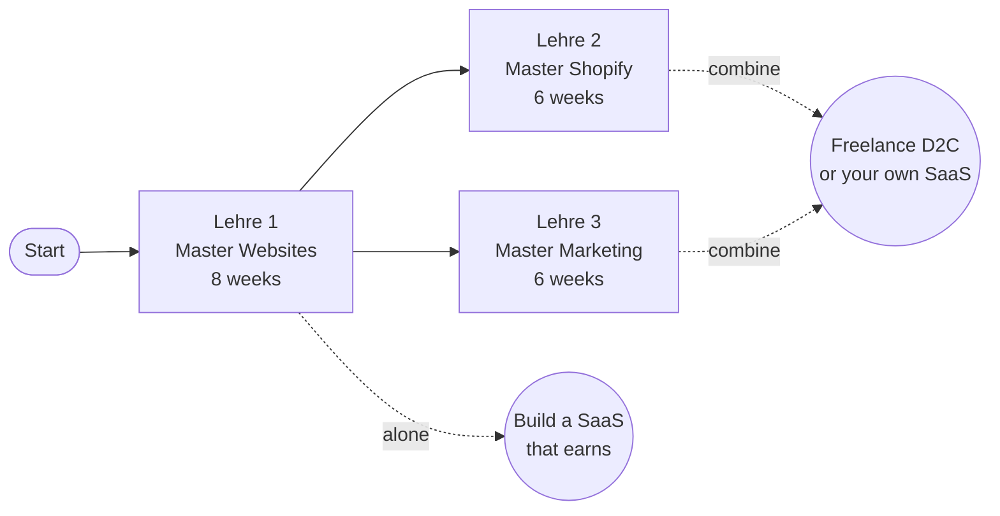
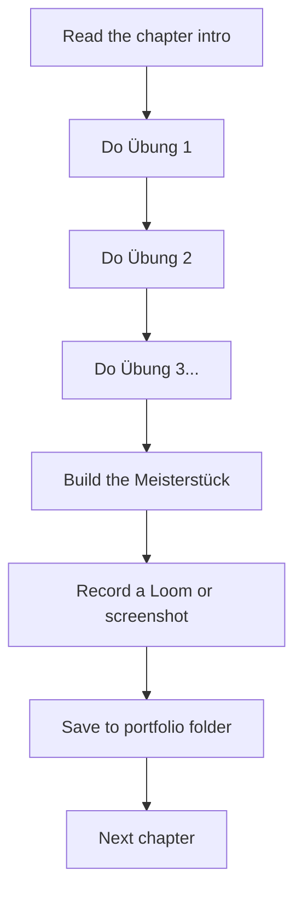

# Welcome, Kat 🧡

This is your guide. Three Master tracks, six to eight weeks each. Read in order, build along, end up able to charge real money.

## What you'll learn

**Lehre 1 — Master Websites.** From "I've never built anything" to a deployed, paid-for SaaS product. Uses Lovable + Claude.

**Lehre 2 — Master Shopify.** From "I've never opened a Shopify admin" to capable of doing what Christa.dev does — Figma-to-Shopify builds, custom sections, Webflow brand sites, CRO.

**Lehre 3 — Master Marketing.** The other half of every D2C business — SEO, paid ads (Google, Meta, TikTok), email automation, conversion optimization. The skill that turns *"I built a store"* into *"I built a store that sells."*

## How to use this guide

You don't read it from start to finish. You **build the projects** as you go. Each chapter ends with a **Meisterstück** — a tangible thing you've made that goes into your portfolio.

Each chapter follows the same Lehrling pattern:

- **Übungen** — small focused exercises with clear deliverables. Each takes 15–90 minutes.
- **Meisterstück** — the chapter's masterwork. Compiles everything you built into one shareable artifact.
- **Lehrling Notiz** — a closing note from me at the end of each chapter.

## The Lehrling promise

A real *Lehre* in Austria isn't a course. It's an apprenticeship. You watch the master, you copy the master, you make mistakes, the master corrects, you make less mistakes, eventually you become a journeyman (*Geselle*), and many years later a master yourself.

This guide is structured the same way:

- Every chapter has **specific things to do**, not just things to read
- You **build real artifacts** that go into a portfolio
- **Mistakes are expected** — debugging is the actual job
- By the end of each Lehre you take a **Gesellenprüfung** (journeyman's test) — usually a project you can charge money for

## What you already have

You're not starting from zero:

- ✅ **GitHub** account
- ✅ **Supabase** account
- ✅ **Claude Code** on your laptop
- ✅ A real laptop and reliable internet
- ✅ Curiosity

That's more than 95% of people who say *"someday I'll learn to code."* You've already done the hardest part — deciding to begin.

## One warning before you start

There will be moments when something breaks and you'll feel stupid. That feeling is the actual job. Every developer at Anthropic, every developer at Lovable, every developer at Shopify — feels it weekly. The skill isn't avoiding it. The skill is staying in your chair five more minutes.

Now turn the page. Lehre 1 starts with the smallest possible website.

— Pabbi
