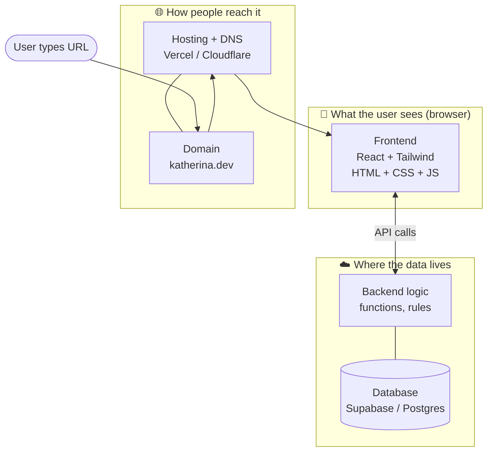
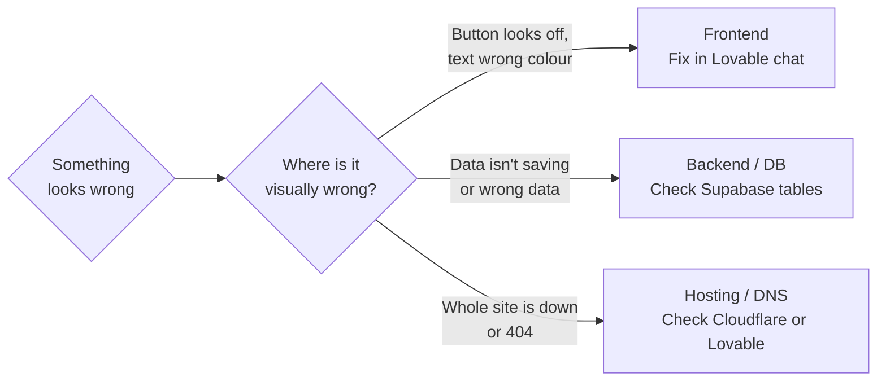

# What a website really is

Before we build anything, a five-minute lesson that pays off forever. Every modern website on the planet has the same three parts. Once you see this picture, everything else clicks into place.

## The three layers

**Frontend.** Everything you see and click. Buttons, forms, pages, animations. Lovable generates this for you as React + Tailwind.

**Backend + Database.** Where data actually lives. Users, posts, orders, anything that has to be remembered after you close the tab. We'll use **Supabase** for this — it gives you a real Postgres database, login system, file storage, and serverless functions in one signup.

**Hosting + Domain.** The address someone types in. `yourapp.lovable.app` for free. Or `katherina.dev` for ~€12/year if you want your own.

Lovable does all three from one chat box. That's why it feels like magic. It isn't magic — it's three things glued together really well.

## The tools we'll use

| Tool | What it does | Cost |
|---|---|---|
| **Lovable** | Build the website by chatting | Free → €25/mo Pro |
| **Supabase** | Database + login (auto-connected by Lovable) | Free tier is plenty |
| **Stripe** | Take payments | Free; 2.9% + €0.25 per payment |
| **Resend** | Send emails | Free up to 3,000/month |
| **Anthropic API** | Claude inside your apps | Pay-per-use, very cheap to start |
| **Claude** | Plan, debug, edit code | You already have it |
| **GitHub** | Store your code | Free |
| **Cloudflare** | Domains, free hosting, CDN | ~€12/year for a domain |

That's the entire stack for everything in Lehre 1. You won't outgrow it for the first ten products you build.

## A debugging mental model

When something breaks, the question is always: **which of the three layers?**

That single question — *"which of the three?"* — is half of debugging. The other half is the error message, which we'll cover in chapter 11.

## A small Übung before continuing

**Übung — Sign up (5 min)**

Open **lovable.dev** in a tab. Click "Start free." Use your GitHub login. You don't need to build anything yet — just have the editor open. Bookmark the page.

That's it. You're ready for Woche 1.

✅ Stop when you can see your empty Lovable dashboard.

---

## Lehrling Notiz

If you ever get lost during the next 12 chapters, come back here. The picture of the three layers is the map for everything you'll build. Frontend / backend / hosting. Every time.
