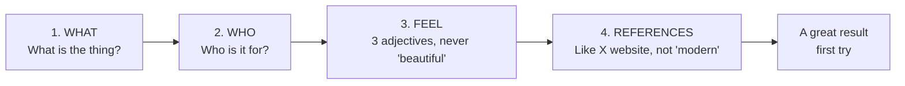

# Woche 2 — Prompting like a senior

This week's claim: **how you talk to AI is the single skill that compounds most.** A senior dev with mediocre prompts ships slower than a beginner with great prompts. The whole week is drills.

Plan: **3–4 hours**, three short sessions.

---

## The four-part recipe

Every good prompt has four parts. Memorize this:



That's the formula. Skip a part, the result gets generic.

---

## Übung 1 — Compare two prompts side by side (20 min)

**Deliverable:** screenshots showing the same idea, prompted two ways.

Open Lovable and create two fresh throwaway projects. For project A, paste:

> Make a nice site for a restaurant.

For project B, paste:

> Build a one-page site for a small vegetarian restaurant in Salzburg called *Wurzel*. Audience: 30–50 year olds who care about local sourcing. Feel: warm, slow, grown-up — not trendy. Hero with a big photo of a wooden table, menu in two columns with prices on the right, address with a map embed, big reservation button at the bottom. Reference style: a quieter version of the Aesop or Loro Piana websites. Earth tones, no bright colours. Serif font for the menu items.

Compare the two. **Screenshot both.** Save side-by-side as `lehre-1/woche-2/specificity-comparison.png`.

This image is your forever-reminder that specificity beats wishful thinking.

✅ Stop when both screenshots are saved.

---

## Übung 2 — The "Plan first" drill (20 min)

**Deliverable:** Lovable produces a written plan before any code.

For your real app, before you build any new feature this whole Lehre, do this first:

> Before you write a single line of code, give me a plan: what pages, what sections on each page, what data the database needs, and what the user flow is. Don't write code yet — just the plan.

Lovable returns text — a plan. Read it. Edit it (in chat: *"change point 3 — the dashboard should also show…"*). Then say *"good, build it."*

This pattern:
- **Costs almost no credits** (planning is short text)
- **Catches bad assumptions early** (you spot them in plain English, not in 500 lines of code)
- **Gives Lovable a clearer target** (it builds better when it knows the whole plan)

Practice with this prompt:

> Plan only — no code. I want to add a "weekly review" page to Schritte where users see their last 7 days of habit completions and get one piece of advice from Claude AI. What pages and database tables do you need? What's the user flow?

Save Lovable's response as `lehre-1/woche-2/plan-first-example.md`.

✅ Stop when you have a written plan saved.

---

## Übung 3 — The three rules drill (45 min)

**Deliverable:** three before/after screenshots demonstrating the rules.

### Rule 1 — One change at a time

In your real app, in one prompt, ask for:

> Fix the spacing on the hero, add a blog section, change the brand colour to green, and make the homepage load faster.

Watch Lovable half-do everything. Screenshot the broken result.

Now revert. In **four separate prompts**, ask for each change one at a time. Screenshot each step.

The pattern: 4 focused prompts ship better than 1 big one. Always.

### Rule 2 — Specific about *which*

Prompt this (deliberately vague):

> Make the button bigger.

Watch Lovable guess which button. Probably the wrong one.

Then:

> The green "Sign up" button at the bottom of the hero section — make it 1.5x bigger and add a small subtle shadow.

Screenshot both results.

### Rule 3 — If it breaks badly, revert

Make a deliberately broken prompt — e.g. *"completely redesign the dashboard with a Y2K aesthetic with green CRT scanlines."* Lovable will produce something either great or terrible.

If it's terrible, **click revert in Lovable.** Don't try to fix it through more prompting. Going back two steps and re-approaching is 10x cheaper than trying to repair.

Screenshot the revert button. That's your friend.

✅ Stop when you have screenshots demonstrating all three rules.

---

## Übung 4 — The "second-pass" magic prompt (30 min)

**Deliverable:** before/after of one section, improved by the magic prompt.

After Lovable builds something, **once,** paste this:

> Now review what you just built and improve it. Tighten the spacing. Make the typography hierarchy clearer with bigger size jumps between H1, H2, and body. Make the primary call-to-action the most visually prominent thing on the page. Ensure mobile looks as good as desktop.

This one prompt makes almost every site 30% better. Use it as your polish pass before publishing.

Try it on your hero section. Screenshot before/after.

✅ Stop when your hero has been through a second pass.

---

## Übung 5 — Build a prompt template library (45 min)

**Deliverable:** five reusable prompt templates saved as `.md` files.

Templates you'll use a hundred times each. Save these as snippets:

**`templates/01-new-feature.md`**
```
Build [WHAT] for [WHO].

Feel: [3 adjectives].
Reference style: like [specific website].

Sections:
1. [section] — [content]
2. [section] — [content]
3. [section] — [content]

Design rules:
- Generous whitespace, at least 80px between sections
- Maximum 2 fonts and 3 colours (1 neutral, 1 dark, 1 accent)
- Headlines at least 48px on desktop
- Mobile-first: every layout works on phone width

Skip generic AI looks: no purple gradients, no Inter font, 
no rounded-everything. Intentional choices only.
```

**`templates/02-plan-first.md`**
```
Plan only — no code.
I want to add [FEATURE] to [APP].
What pages and database tables are needed?
What's the user flow?
Show me the plan, then I'll say "build it."
```

**`templates/03-polish-pass.md`**
```
Review what you built and improve it:
- Tighten the spacing
- Make the type hierarchy clearer (bigger jumps H1 → H2 → body)
- Make the primary CTA visually dominant
- Ensure mobile is as polished as desktop
```

**`templates/04-debug.md`**
```
This error appeared: [paste error]
Right before it, I asked you to: [paste prompt]
Tell me in plain English what went wrong, then fix it.
```

**`templates/05-rls-check.md`**
```
Audit the Supabase tables in this project.
For each table, tell me:
- Is Row Level Security enabled?
- Can users only read/edit/delete their own rows?
- Are there any tables that leak data across users?
Then fix any gaps.
```

Save these five files in your portfolio folder, in a `templates/` subfolder.

✅ Stop when all five template files exist.

---

## Übung 6 — Hard mode: rebuild your hero with no chat (30 min)

**Deliverable:** your project's hero, rebuilt from scratch using only one prompt.

Open a brand new Lovable project. Using **one single prompt** (use the template from Übung 5), recreate your project's hero section exactly the way it looks now in your live app.

The constraint: you don't get a second prompt. You have to nail it first try.

Compare the result to your real hero. How close did you get? What was missing from your prompt?

This drill teaches you what a *complete* prompt looks like. After 3–4 rounds of this drill, your one-shot prompts beat most people's three-shot prompts.

✅ Stop when you have a one-prompt rebuild attempt screenshotted.

---

## Meisterstück for Woche 2

By the end of this week you have:

- [ ] Specificity comparison screenshots (Übung 1)
- [ ] A planning-first example saved (Übung 2)
- [ ] Three before/after screenshots demonstrating the rules (Übung 3)
- [ ] A second-pass before/after (Übung 4)
- [ ] Five reusable prompt templates saved (Übung 5)
- [ ] A one-prompt hero rebuild attempt (Übung 6)

**Loom (2 min):** screen-record yourself using one of your templates to add a small feature to your app. Show the prompt going in, the plan coming back, you approving it, the feature built. Save to `portfolio/lehre-1/woche-2-meisterstueck.mp4`.

---

## Lehrling Notiz

You'll feel slower this week than week 1. That's correct. Week 1 was "see the magic." Week 2 is "learn to wield it." Slow is fine. The templates you saved this week will save you hundreds of hours over the next two years.
