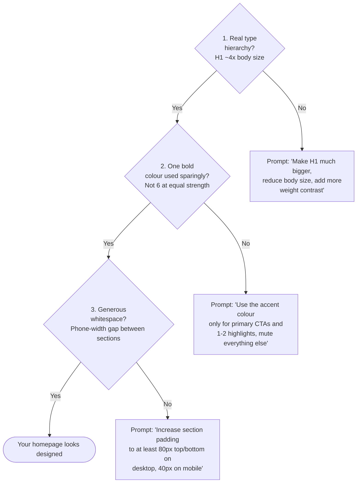

# Woche 3 — Design like a designer

The chapter that separates *"AI made this"* from *"a designer made this."* Twenty extra minutes per project triples its perceived value.

Plan: **3–4 hours** across two evenings.

---

## The five rules to ask for, every time

Paste this near the end of any design prompt:

> Design rules:
> - Generous whitespace — at least 80px between sections on desktop
> - Maximum 2 fonts and 3 colours total (1 neutral, 1 dark, 1 accent)
> - Buttons have a clear hover state with a small transition
> - Headlines are big — at least 48px on desktop
> - Mobile-first: every layout works perfectly on phone-width

That single block raises the floor of everything you ship.

---

## Übung 1 — Build your taste palette (30 min)

**Deliverable:** a one-page reference document with the fonts, colours, and inspiration sites you'll reuse across your career.

Create a markdown file `lehre-1/woche-3/my-taste-palette.md` and fill it with:

**Fonts I'll reuse** — pairs you tested at fonts.google.com:
- Headline: ___ (e.g. Fraunces, Playfair Display, Instrument Serif)
- Body: ___ (e.g. Inter, DM Sans, Geist)

**Colour combos I love** — three palettes from coolors.co:
- Palette A: bg `#______` text `#______` accent `#______`
- Palette B: ...
- Palette C: ...

**Sites that inspire me** — five real URLs with one sentence each on why:
- `aesop.com` — quiet luxury, generous whitespace, serif-led
- ...

This file is yours forever. You'll add to it for years.

✅ Stop when the file has 2 font pairs, 3 colour palettes, and 5 inspiration URLs.

---

## Übung 2 — The Doppelgänger drill (90 min)

**Deliverable:** your project's homepage, redesigned to feel like one of your inspiration sites.

The apprentice technique that produces taste fastest: **copy a master.**

1. Pick one site from your inspiration list.
2. Open it in one tab. Open your Lovable project in another.
3. Without looking at any other guide, get your homepage to feel similar — same vibe, same typography weight, same colour temperature. Not a pixel copy. A *feel* copy.
4. **Set a 90-minute timer.** When it's up, stop.

When done, screenshot yours next to the original. Save as `lehre-1/woche-3/doppelgaenger-01.png`.

This drill is uncomfortable. You'll feel like a copy-cat. You're not — every designer learns this way. The drill trains your eye. Do it three times in three different niches and your default Lovable output looks 5x better.

✅ Stop when the 90 minutes are up and the comparison is saved.

---

## Übung 3 — Three signs of "designed" (15 min)

**Deliverable:** screenshots of your homepage with each sign checked.

A real designer's work has these three things. AI defaults often don't:

Walk through your homepage on a phone screen. Take three screenshots, each labelled with which of the three signs it passes.

✅ Stop when all three signs are visibly passing.

---

## Übung 4 — Image generation drill (30 min)

**Deliverable:** three AI-generated images that match your brand, used in the live site.

Lovable has built-in image generation. Stop using stock photos. Practice this:

For your project, generate three images via Lovable chat:

> Generate a hero image: [describe in vivid detail — light, mood, subject, composition, but no text in the image].

For Schritte you might prompt:

> Generate a hero image: a quiet wooden writing desk in morning light, a small notebook open with a pen, a cup of black tea steaming, soft natural daylight from a window on the left, painterly, no text, photorealistic but slightly muted.

Try three different styles for the same content. Pick the best. Use it as your hero image.

**Tip:** if Lovable's images aren't great enough, switch to a dedicated tool: **Midjourney**, **Flux**, or **Imagen**. Paste the same prompt. The output is usually better than embedded tools.

✅ Stop when one AI-generated image is live in your project's hero.

---

## Übung 5 — Mobile audit walk (30 min)

**Deliverable:** a list of mobile fixes applied to your project.

Most beginners design on desktop and "check mobile at the end." Pros do the opposite.

Open Chrome DevTools (right-click → Inspect → device toolbar). Set viewport to **iPhone SE 375×667**. Walk through every page of your project. For each page, look for:

- Headlines that wrap badly mid-word
- Buttons smaller than 44px tall (Apple's minimum touch target)
- Text smaller than 16px (illegible on phones)
- Horizontal scroll (always a bug — never desired)
- Sections so wide they break out of the screen
- "Add to cart" / primary CTA below the fold
- Padding either too cramped or absurdly wide

For each issue you find, prompt Lovable to fix it. Re-check.

Save a `mobile-audit.md` listing every issue you found and how you fixed it.

✅ Stop when iPhone SE shows zero horizontal scroll and every primary CTA is above the fold.

---

## Übung 6 — The "second-pass" pass (15 min)

**Deliverable:** your homepage, after one "polish pass" prompt.

Run this once on your homepage:

> Review what you built and improve it: tighten the spacing, make the typography hierarchy clearer with bigger size jumps between H1, H2 and body, make the primary CTA the most visually prominent thing on the page, and ensure mobile looks as good as desktop.

Take a before/after screenshot.

✅ Stop when the polish pass has been done and screenshotted.

---

## Meisterstück for Woche 3

By the end of this week you have:

- [ ] A personal taste palette document (Übung 1)
- [ ] One Doppelgänger comparison screenshotted (Übung 2)
- [ ] Three signs verified on your homepage (Übung 3)
- [ ] One AI-generated hero image live (Übung 4)
- [ ] A mobile audit document with fixes applied (Übung 5)
- [ ] A polish-pass before/after (Übung 6)

**Loom (2 min):** screen record yourself walking through your homepage on both desktop and mobile, pointing out where you applied each design rule. Save to `portfolio/lehre-1/woche-3-meisterstueck.mp4`.

This Loom is the first one that shows you *talk* like a designer too. Founders will hire you on this Loom alone.

---

## Lehrling Notiz

Design is the part most beginners think they "can't do." The truth is design is 80% restraint and 20% reference. You don't need to be born with taste. You need to study sites you admire and steal patterns thoughtfully. The Doppelgänger drill alone, done weekly for six months, makes you indistinguishable from a real designer.
