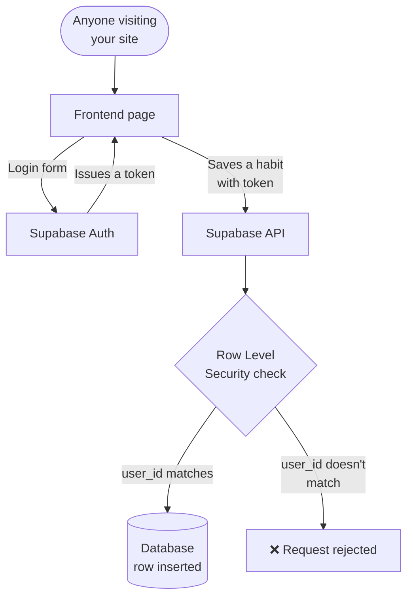

# Woche 4 — Accounts & database

The week your toy becomes a product. You add login, save real data per user, and lock it down so no one can read anyone else's stuff.

This is the most important technical chapter in the whole guide. Don't skip Übungen.

Plan: **5–6 hours** across 3 sessions.

---

## The mental model



Auth + Row Level Security = users only see their own data. This is how every real app works. The same pattern powers Instagram, Twitter, Airbnb, your bank's online portal. Once you've built it once, you've built it forever.

---

## Übung 1 — Connect Supabase (10 min)

**Deliverable:** Supabase connected to your Lovable project.

In Lovable, click the **Supabase** icon (top-right). Choose "Connect new Supabase project." Wait 30 seconds. Done.

Lovable creates a database, an auth system, and an API for you, all wired up. You won't see anything change in the preview yet — the wiring is invisible until features need it.

✅ Stop when the Supabase icon in Lovable shows as connected.

---

## Übung 2 — Add user accounts (30 min)

**Deliverable:** users can sign up and log in.

In Lovable:

> Add user accounts using Supabase Auth. Users can sign up with email + password. Add `/login` and `/signup` pages. After signing up they go to `/dashboard`. If they're not logged in and try to visit `/dashboard`, redirect them to `/login`. The header should show "Sign in" if not logged in, or the user's email + "Sign out" if logged in.

Wait for Lovable to build it.

**Test the full flow:**
1. Visit your live site in an incognito tab
2. Click Sign up → use a fake email
3. Get redirected to dashboard
4. Sign out
5. Log back in
6. Try visiting `/dashboard` while logged out (incognito) — confirm redirect

If any step doesn't work, prompt Lovable to fix specifically that step. Don't move on until all 6 work.

✅ Stop when you've completed the full signup → logout → login flow yourself.

---

## Übung 3 — Add your first real data (45 min)

**Deliverable:** users can create, see, and delete a list of items belonging only to them.

Adapt this prompt to your app:

**For Schritte:**
> On the dashboard, let logged-in users add habits. Show a text input "What's a habit you want to track?" and an "Add" button. Save each habit to a Supabase table called `habits` with columns: `id` (uuid), `user_id` (uuid, foreign key to auth.users), `name` (text), `created_at` (timestamp). Below the form, show a list of the user's habits. Each habit has a small delete button.
>
> **Important:** enable Row Level Security on the `habits` table. Users can only SELECT, INSERT, UPDATE, DELETE rows where `user_id = auth.uid()`.

**For TutorBuch:**
> On the dashboard, let logged-in users (tutors) add subjects they teach. Table: `subjects` (id, user_id, name, hourly_rate, created_at). Show form + list with delete. RLS: tutors only see their own subjects.

**For Aufsatz-Helfer:**
> On the dashboard, let users save essays they've written. Table: `essays` (id, user_id, title, body, created_at). Show form + list with delete. RLS: users only see their own essays.

Test it:
1. Sign up as User A. Add 3 items. See them in your list.
2. Sign out. Sign up as User B (different email). Add 2 items. Should *only* see User B's 2 items, never User A's.
3. **This is the critical test.** If User B sees User A's items, RLS is wrong. Stop and fix.

✅ Stop when two different users have isolated data.

---

## Übung 4 — Inspect the database directly (20 min)

**Deliverable:** you can find a specific row in Supabase and explain its columns.

Open the **Supabase dashboard** for your project. Navigate to **Table editor → habits (or your table)**.

You'll see a spreadsheet-like view of every row. **Pretend you're a debugger.**

- Find the row you created as User A. Note the `user_id` value (a UUID).
- Find the row you created as User B. Note its `user_id`. Verify it's different.
- Use the SQL editor (left sidebar): paste this and run it:

```sql
select id, name, user_id, created_at from public.habits order by created_at desc limit 10;
```

You should see your real data printed as a result table. **This is what your data really looks like.** Not magic. Just rows and columns.

✅ Stop when you've run one SQL query and seen the result.

---

## Übung 5 — Row Level Security audit (30 min)

**Deliverable:** every table in your project has RLS enabled and rules that protect users.

This is the security check most beginners skip. **Never skip it again.**

In Lovable, paste:

> Audit every table in this project. For each one, tell me:
> - Is Row Level Security enabled?
> - What policies exist? (read, write, update, delete)
> - Could a logged-in user A read user B's rows? (answer yes or no for each table)
> - If RLS is missing or weak, fix it.

Lovable will scan all your tables and tell you. Read the output carefully. **Verify** by:

1. Open Supabase dashboard → Database → Tables
2. Click your table → "Auth" tab
3. Confirm "RLS enabled" toggle is ON
4. Read each policy — does the `USING` clause check `user_id = auth.uid()`?

If anything is wrong, fix it now. **Shipping a Supabase app without RLS is the most common way beginners leak data.**

✅ Stop when every table has RLS verified manually in the Supabase dashboard.

---

## Übung 6 — Add update + relationships (45 min)

**Deliverable:** your data model has two related tables, and rows can be updated, not just created/deleted.

So far you have one table. Real apps have multiple linked tables. Practice this now.

**For Schritte:**
> Add a table `habit_completions` with columns: `id`, `habit_id` (foreign key to habits), `user_id`, `completed_on` (date). On each habit in the list, add a checkmark button that creates a completion row for today. The button should show as filled if there's already a completion for today. Toggle on/off. RLS: users only see their own completions.

**For TutorBuch:**
> Add a table `availability_slots` (id, subject_id, user_id, day_of_week, start_time, end_time). On each subject, let the tutor set what days/times they're available for that subject. RLS as before.

**For Aufsatz-Helfer:**
> Add a table `feedback_versions` (id, essay_id, user_id, feedback_text, created_at). Each essay can have multiple feedback versions saved over time. Users see a list of past feedbacks under each essay. RLS as before.

Test it: create a habit, mark today's completion, untick it, tick again, refresh page, verify the state persists.

✅ Stop when you have two related tables and can update rows.

---

## Meisterstück for Woche 4

- [ ] Supabase connected to your project (Übung 1)
- [ ] Signup → login → dashboard flow tested (Übung 2)
- [ ] One table with create / delete + RLS (Übung 3)
- [ ] Real data inspected via Supabase dashboard + one SQL query run (Übung 4)
- [ ] RLS audit complete on every table (Übung 5)
- [ ] Second related table + update functionality (Übung 6)

**Loom (3 min):** sign up as User A, add data, then sign up as User B (incognito), add different data, then show that each user only sees their own. Save to `portfolio/lehre-1/woche-4-meisterstueck.mp4`.

**This Loom is portfolio gold.** It demonstrates you can build secure multi-user apps. That's what separates real developers from "I made something in Lovable."

---

## Lehrling Notiz

If you only learn one thing from this Lehre, learn the RLS audit. Every paid SaaS you ever ship will have user data. Every breach you've read about in the news happened because someone skipped this step. You're now ahead of probably 60% of working developers who don't fully understand RLS. Don't let that knowledge atrophy — run an RLS audit on every project, every time.
