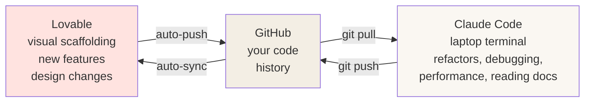

# Woche 5 — Claude Code for the hard 20%

Lovable is fast for the first 80% of any project. For the last 20% — refactors, tricky bugs, performance, custom logic — you want **Claude Code** on your laptop.

This week: graduate from Lovable-only to the pro dance between Lovable + Claude Code + GitHub.

Plan: **4–5 hours** across 2–3 sessions.

---

## The two-tool dance



This loop is how senior solo founders ship 10x faster than agencies. Both tools are great at different things. Use both.

---

## Übung 1 — Clone your project locally (15 min)

**Deliverable:** your project's code as a folder on your laptop, with `npm run dev` working.

In your terminal:

```bash
cd ~/projects   # or wherever you want
git clone https://github.com/YOUR-USERNAME/[your-project].git
cd [your-project]
npm install
npm run dev
```

Open the URL printed in the terminal (usually `http://localhost:5173`). **You're now looking at your real project running on your laptop.** Edit a file, save, the page refreshes.

Open the folder in **VS Code** or **Cursor**.

✅ Stop when `npm run dev` shows your project at localhost.

---

## Übung 2 — Project tour with Claude Code (20 min)

**Deliverable:** notes on every important file in your project.

In your project folder, run:

```bash
claude
```

Then ask:

> Read this entire project. Then give me:
> 1. A one-paragraph description of what this app does
> 2. A bullet list of every file in `src/`, with one line explaining its purpose
> 3. What the data flow is when a user signs up and adds their first habit (or whatever your main feature is)

Save the answer as `lehre-1/woche-5/project-map.md`.

This is the single most useful thing Claude Code does: **understanding code you didn't write yourself.** You'll do this on every client project of your career.

✅ Stop when the project map is saved.

---

## Übung 3 — A real refactor (45 min)

**Deliverable:** one terminology change applied consistently across the whole codebase, committed to git.

Pick something you'd like to rename in your app. Examples:

- For Schritte: rename "habit" to "ritual" everywhere
- For TutorBuch: rename "subject" to "topic" everywhere
- For Aufsatz-Helfer: rename "essay" to "text" everywhere

In Claude Code:

> Rename every reference to "habit" to "ritual" across this entire codebase. Update React component names, props, variable names, database column names, page titles, and database tables. Walk me through every file you'd change before making any edits.

Claude shows a plan. Read it. Approve.

After it's done:

```bash
git diff   # see every change Claude made
npm run dev   # verify the app still works
```

If it works, commit:

```bash
git add -A
git commit -m "Refactor: rename habit → ritual"
git push
```

Open your Lovable preview. **Lovable picks up your local changes from GitHub** within a minute. Open the theme editor — your renamed feature is everywhere.

✅ Stop when the rename is live in both your laptop and Lovable.

---

## Übung 4 — A real bug fix (45 min)

**Deliverable:** one bug found and fixed using Claude Code's whole-codebase view.

Find or invent a bug. Examples:
- Clicking delete twice quickly deletes two rows
- The page sometimes shows stale data after add
- Mobile keyboard covers the input field when typing

In Claude Code:

> I have a bug. [Describe in detail what happens, what you expected, and any error messages.] Read the relevant files and reason about what's wrong. Don't change anything yet — first tell me what you think the cause is and why.

Claude reasons through it. **Read the reasoning carefully.** Half the time the explanation alone teaches you something. Then:

> Good — fix it.

After the fix, test it manually. Commit. Push.

✅ Stop when the bug is gone and you've committed the fix.

---

## Übung 5 — The three project-health prompts (30 min)

**Deliverable:** three security/quality reports saved to your portfolio.

Run these three prompts in Claude Code, one at a time:

**Security audit:**
> Audit this codebase for the most common web security mistakes: XSS, SQL injection, missing auth checks, exposed API keys or secrets, missing CSRF protection, weak Row Level Security policies. Rank everything you find by severity.

**Dependency cleanup:**
> Look at package.json. List unused dependencies, outdated dependencies, and duplicated functionality (e.g. two date libraries). Suggest specific removals.

**Performance scan:**
> Find the three biggest performance issues in this codebase. Look at bundle size, unnecessary re-renders, missing memoization, unoptimized images, and database query patterns. Rank by impact.

Save each as `lehre-1/woche-5/audit-[type].md` in your portfolio.

You don't have to fix everything. Just **knowing** is half the value. You can quote these audits when a future client asks *"do you do security/perf reviews?"* — yes, here are three samples.

✅ Stop when all three audit files exist.

---

## Übung 6 — Write tests for one function (45 min)

**Deliverable:** at least three unit tests passing for one piece of business logic in your app.

Real freelancers know testing — it's the difference between "I shipped a thing" and "I shipped a thing that won't break next week."

> Pick the most logic-heavy function in this codebase (e.g. the one that calculates streaks, or filters habits by date, or scores an essay). Write Vitest unit tests for it. Set up Vitest if it's not already set up. Show me the test file and explain each test case in plain English.

After Claude writes the tests, run them:

```bash
npm test
```

You should see all green checkmarks. Commit:

```bash
git add -A
git commit -m "Add unit tests for [function name]"
git push
```

✅ Stop when at least 3 tests are passing.

---

## Meisterstück for Woche 5

- [ ] Project running locally with `npm run dev` (Übung 1)
- [ ] Project map document saved (Übung 2)
- [ ] One refactor committed and live (Übung 3)
- [ ] One bug fixed and committed (Übung 4)
- [ ] Three audit reports saved (Übung 5)
- [ ] At least 3 unit tests passing (Übung 6)

**Loom (3 min):** show your terminal running Claude Code, ask Claude to add a small new feature (e.g. "add a search box on the dashboard that filters habits as you type"), watch Claude write the code, then commit and push and watch it appear in Lovable. Save to `portfolio/lehre-1/woche-5-meisterstueck.mp4`.

That Loom is what separates you from someone who *only* uses Lovable. Anyone hiring a freelance dev wants to see this loop.

---

## Lehrling Notiz

After this week you'll feel a strong urge to abandon Lovable entirely and work only in Claude Code. **Don't.** Lovable is faster for visual things and new features. Claude Code is faster for refactors and debugging. The pros use both, every day, in this exact dance. Resist the purist instinct.
