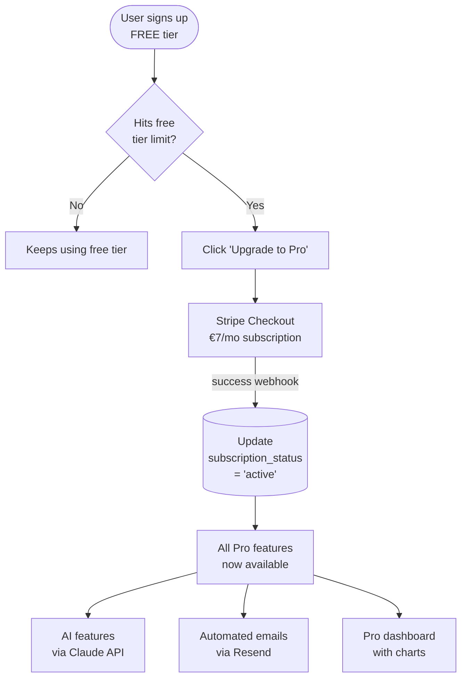

# Woche 6 — Features people pay for

The week your app stops being a project and starts being a *product*. Stripe subscriptions, AI features powered by Claude, automated emails — the trio that turns a portfolio piece into a paying business.

Plan: **6–8 hours** across 3 evenings.

---

## What the paid feature stack looks like

Every paid feature in your app is gated on one Supabase column: `users.subscription_status`. Free users see free things. Active subscribers see paid things. That's the whole architecture.

---

## Übung 1 — Stripe Checkout, basic subscription (90 min)

**Deliverable:** users can subscribe to a paid plan via Stripe (in test mode), and the database knows who's paid.

**Step 1 — Get Stripe keys.** Sign up at **stripe.com**. Don't activate live mode yet — stay in **Test mode** (toggle top-right). Go to **Developers → API keys**. Copy the **Publishable key** and **Secret key**.

**Step 2 — Add to Lovable.** In your Lovable project, find **Settings → Environment variables (Secrets)**. Add:
- `STRIPE_SECRET_KEY` = (your test secret key)
- `STRIPE_PUBLISHABLE_KEY` = (your test publishable key)

**Step 3 — Prompt Lovable:**

> Add Stripe Checkout for a Pro subscription. Two plans:
> - **Free** — limit: only 3 habits (or 1 essay / 1 booking, adapt to your app)
> - **Pro** — €7/month, unlimited
>
> When someone clicks "Upgrade to Pro," send them to Stripe Checkout. On success, save their `stripe_customer_id` and set `subscription_status = 'active'` on the users table. Set up a Stripe webhook to handle subscription created, updated, cancelled.
>
> Gate the relevant features by `subscription_status`. Free users hitting the limit see a "Upgrade to Pro" CTA.

**Step 4 — Test it.** Use Stripe's test card `4242 4242 4242 4242` (any future date, any CVC). Subscribe. Check Supabase — your user should now have `subscription_status = 'active'`.

**Step 5 — Test cancellation.** In Stripe dashboard, cancel the test subscription. The webhook should update your DB. Verify.

✅ Stop when you've completed a full test subscribe + cancel and the database reflects both.

---

## Übung 2 — Your first AI feature with Claude API (90 min)

**Deliverable:** a working AI feature in your app, powered by the Anthropic API.

Customers pay 10x more for products with intelligent AI inside. Your biggest unfair advantage.

**Step 1 — Get an Anthropic API key.** Sign up at **console.anthropic.com**. Buy €5 of credit — that's enough for thousands of free-tier AI calls. **Developers → API keys → Create**. Copy.

**Step 2 — Add to Lovable Secrets:** `ANTHROPIC_API_KEY`.

**Step 3 — Prompt:** (adapt to your app)

**For Schritte:**
> Add a "Weekly review" feature for Pro users. Once a week, they click "Analyse my week" — send their last 7 days of habit completions to the Anthropic Claude API (model `claude-sonnet-4-5`). Ask Claude to give them ONE specific, kind, actionable piece of advice (under 60 words). Show the response in a nice card. Cache the result so refreshing doesn't burn API credits — only re-generate if the user explicitly clicks "Refresh advice."

**For TutorBuch:**
> Add a "Schedule analyser" feature for Pro users. They click "Improve my week" — send their availability + bookings + cancellations from the last 30 days to Claude API. Ask Claude to suggest one specific change to their availability that would maximise bookings, in 60 words. Cache it.

**For Aufsatz-Helfer:**
> The core feature: a Pro user pastes an essay, picks the type (Erörterung / Interpretation / Textanalyse), and clicks "Get feedback." Send to Claude API with a detailed system prompt that puts Claude in the role of an experienced Austrian Gymnasium teacher. Return structured feedback (Sprache / Inhalt / Aufbau, each with 2-3 specific suggestions). Save the feedback to the database so the user can view past feedback.

**Step 4 — Test it three times.** Try with different inputs. Confirm the responses feel useful, not generic. If responses feel weak, **tune the system prompt** — that's the single thing that separates good AI features from bad ones. The system prompt is your secret recipe.

✅ Stop when your AI feature produces useful, specific output 3 times in a row.

---

## Übung 3 — Email automation with Resend (60 min)

**Deliverable:** two transactional emails sending automatically.

**Step 1 — Sign up at resend.com.** Free tier: 3,000 emails/month. Verify a domain (or use Resend's test domain to start).

**Step 2 — Add `RESEND_API_KEY` to Lovable Secrets.**

**Step 3 — Prompt:**

> Set up two automated emails using Resend:
>
> 1. **Welcome email** — sent when a user signs up. Subject: "Welcome to [app name] 🌱". Body: warm 2-paragraph welcome, what they should do next, link back to the app. Use the user's first name if available.
>
> 2. **Re-engagement email** — sent when a Pro user hasn't logged in for 7 days. Subject: "We saved your spot." Body: short, gentle, no guilt-trip. Include a link to log in.
>
> For (2), set up a daily background task (Supabase Edge Function or cron job) that checks for users inactive for ≥7 days and sends the email.

**Step 4 — Test the welcome email.** Sign up with a new test email (use Gmail + sign — `gummihurdal+test1@gmail.com` arrives in your `gummihurdal@gmail.com` inbox). Verify the email arrives within 60 seconds.

✅ Stop when you've received your welcome email in a real inbox.

---

## Übung 4 — Analytics dashboard for Pro users (60 min)

**Deliverable:** a /analytics page (Pro-only) with at least 3 charts.

People love seeing their data made pretty. They'll pay €5/month forever just to look at their own line chart.

> Add an `/analytics` page (Pro-only — free users see a "Upgrade for analytics" page instead). Show:
> - A line chart of [completions / bookings / essays-written] per day for the last 30 days
> - A bar chart of top 5 [habits / subjects / essay types] by [completion rate / bookings / count]
> - A big number stat showing [longest active streak / total revenue this month / total feedback delivered]
>
> Use Recharts for the charts. Match the design system (cream background, navy text, coral accent). Mobile-responsive.

The trick: make the empty state useful. If a Pro user has only 2 days of data, the chart shouldn't look broken — it should look like a *start*.

✅ Stop when the Pro analytics page renders with real data and looks polished.

---

## Übung 5 — Multi-tenancy (90 min, optional but recommended)

**Deliverable:** users can belong to a team / organisation with multiple members.

This is the unlock that turns €7/mo apps into €49/mo apps. Skip it on round 1, come back for round 2.

> Add organisations. A user can create an organisation, invite others by email (sent via Resend), and assign roles (admin, member). All habits/subjects/essays belong to the organisation, not the user. A user can belong to multiple organisations and switch between them via a top-right dropdown.
>
> Update RLS: users can only see rows where they're a member of the row's organisation.

This is the single most-reused pattern in B2B SaaS. Once you've built it, you reuse it forever.

✅ Stop when you can create an organisation, invite a second account, and see they share data.

---

## Meisterstück for Woche 6

- [ ] Stripe subscription working in test mode (Übung 1)
- [ ] One AI feature using Claude API, useful output (Übung 2)
- [ ] Welcome + re-engagement emails sending (Übung 3)
- [ ] Pro analytics page with 3 charts (Übung 4)
- [ ] Optional: multi-tenant organisations (Übung 5)

**Loom (4 min):** screen-record the full money flow:
1. New user signs up → receives welcome email (show the inbox)
2. Try to add a 4th habit on free tier → see upgrade prompt
3. Click upgrade → Stripe Checkout in test mode → success
4. Back in app, add unlimited habits, use AI feature, view analytics

Save to `portfolio/lehre-1/woche-6-meisterstueck.mp4`. **This is the most valuable Loom in the whole Lehre.** It proves you can build a complete SaaS.

---

## Lehrling Notiz

Don't go live with real money yet. Stay in Stripe test mode through next week. Next week is where you wire up the production-ready stuff: custom domain, performance, legal pages. Then we go live properly.
