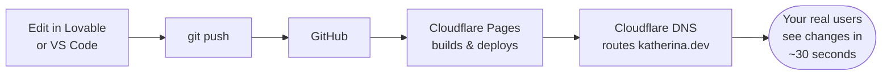

# Woche 7 — Live gehen

You have a working SaaS in test mode. This week we make it real — custom domain, fast performance, proper SEO, legal compliance for Austria, and Stripe in live mode taking real money.

Plan: **5–6 hours** across 2 evenings.

---

## The deploy pipeline



Once this pipeline is set up, every commit becomes a live update in ~30 seconds. No manual deploys. No DevOps team. Just `git push` and you're live.

---

## Übung 1 — Buy a domain (10 min)

**Deliverable:** a domain registered in your name.

Pick a short, memorable domain. Some good patterns:

- The app name: `schritte.app`
- Your name: `katherina.dev`
- A descriptive phrase: `ihrgewohnheiten.at`

Go to **dash.cloudflare.com → Domain Registration**. Search. Buy. Don't overthink — `.app`, `.dev`, `.io` all work. `.at` is the Austrian standard.

Total cost: ~€10–15/year. Pay with the family card.

✅ Stop when the domain shows in your Cloudflare account.

---

## Übung 2 — Custom domain on Lovable (15 min)

**Deliverable:** your app live at your real domain.

In Lovable: **Settings → Custom Domain → Add domain.** Paste your domain. Lovable shows you DNS records to add.

In Cloudflare: open your domain → **DNS → Records**. Add the records Lovable showed you. Save.

Wait 5–10 minutes (sometimes faster). Visit your domain. **HTTPS works automatically** — Cloudflare handles certificates.

✅ Stop when your real domain shows your app over HTTPS.

---

## Übung 3 — Lighthouse audit (60 min)

**Deliverable:** Lighthouse scores 90+ on all four metrics, on mobile.

Open Chrome DevTools → Lighthouse tab. Set device to **Mobile**. Click **Analyze page load.**

You get 4 scores: Performance, Accessibility, Best Practices, SEO. Aim **90+ on all four**.

Common fixes:

```mermaid
flowchart TD
  low{Which score<br/>is low?}
  low -->|Performance| perf[• Compress images (squoosh.app)<br/>• Lazy-load below-fold images<br/>• Remove unused JS/CSS<br/>• Avoid render-blocking fonts]
  low -->|Accessibility| a11y[• Add alt text to images<br/>• Fix colour contrast<br/>• Add aria-labels to icon buttons<br/>• Use semantic HTML]
  low -->|Best Practices| bp[• Fix console errors<br/>• Use HTTPS everywhere<br/>• Update old libraries]
  low -->|SEO| seo[• Unique meta description<br/>• Page title<br/>• robots.txt<br/>• Crawlable links]
```

For each red/yellow item, ask Lovable:

> Lighthouse says [issue]. Fix it specifically.

Re-run after each fix. Iterate until green.

✅ Stop when mobile Lighthouse shows ≥90 on all four scores.

---

## Übung 4 — SEO basics (30 min)

**Deliverable:** every page has proper meta tags, structured data, and a sitemap.

> Set up proper SEO across the site:
> - Unique `<title>` and `<meta name="description">` on every page
> - Open Graph image at `/og.png` (1200×630) — generate one for me
> - `robots.txt` that allows everything
> - `sitemap.xml` listing every public page
> - JSON-LD structured data on the homepage (SoftwareApplication schema)
> - Canonical URLs on every page

Test it: paste your domain into **opengraph.xyz** — your site preview should show a proper image and description, like it would on WhatsApp or LinkedIn.

✅ Stop when opengraph.xyz shows a good preview of your site.

---

## Übung 5 — Legal pages for Austria (45 min)

**Deliverable:** Privacy Policy, Terms, and Impressum live and linked from the footer.

> Generate three legal pages tailored for an Austrian sole proprietor (Einzelunternehmen) operating in the EU:
>
> 1. **Privacy Policy** — GDPR-compliant. Mentions: data we collect (email, app data), why, retention period, user rights (access, deletion, portability), our sub-processors (Supabase, Stripe, Resend, Anthropic, Cloudflare), contact for data requests.
>
> 2. **Terms of Service** — fair-use, subscription terms, cancellation rights (14-day right of withdrawal per EU law), liability disclaimers.
>
> 3. **Impressum** — legally required in Austria. Includes: full legal name, address, contact email, business registration number if applicable, regulatory authority.
>
> Link all three from the footer of every page.

**Important:** these drafts are a starting point. Before you charge real customers, **have a real human review them** — your dad knows lawyers in Switzerland and Austria. Don't skip this for legal pages. Lovable's output is a 90% baseline, not gospel.

✅ Stop when all three pages exist, are linked from the footer, and you've added a note to get them reviewed.

---

## Übung 6 — Analytics with Plausible or Umami (30 min)

**Deliverable:** real visitor data flowing into a dashboard.

You can't improve what you don't measure.

**Option A — Plausible (€9/mo, easiest):** sign up at plausible.io, add your domain, paste their script tag into Lovable.

**Option B — Umami (free, self-hosted):** add a Umami project. Heavier setup but no monthly cost. Good if you already have the Hetzner VPS.

In Lovable:

> Add [Plausible / Umami] analytics. Track these custom events:
> - `signup`
> - `upgrade_clicked`
> - `subscription_created`
> - `ai_feature_used`

Visit your site from your phone. Wait 5 minutes. Check the dashboard. You should see at least one visit.

Why not Google Analytics? Cookie banners, GDPR pain, slower load. Plausible is privacy-friendly, GDPR-compliant, no banner needed.

✅ Stop when one real visit shows in your analytics dashboard.

---

## Übung 7 — Switch Stripe to live mode (30 min)

**Deliverable:** real money can flow into your account.

Only do this after Übungen 1–6 are all green. **Real money requires real polish.**

1. In Stripe Dashboard, toggle **Test mode → Live mode** (top right).
2. **Activate your account** — Stripe asks for business details (use family info for now, talk to me first about whether to register a Kleinunternehmer).
3. Get new **live** API keys.
4. Update Lovable Secrets with the live keys (replace test keys).
5. **Test with a real card** — your own. Subscribe. Then immediately cancel and refund yourself in Stripe Dashboard. That confirms the live flow works end-to-end.

You're now a business that can accept payments. Keep that in mind.

✅ Stop when you've made a real €7 charge, then refunded it.

---

## The pre-launch checklist

Before announcing publicly, every one of these must be green:

- [ ] Custom domain live with HTTPS
- [ ] Lighthouse ≥90 on mobile, all four scores
- [ ] Every page has unique title + meta description
- [ ] Open Graph preview looks good (test on WhatsApp)
- [ ] Privacy, Terms, Impressum linked from footer
- [ ] Stripe in **live mode** (not test)
- [ ] All Supabase tables have Row Level Security
- [ ] Analytics tracking real visits
- [ ] You've used the live app yourself for at least one full session, on a phone
- [ ] Welcome email actually arrives in real inboxes
- [ ] No console errors when you open DevTools on the homepage

Ten green checkmarks = you're more prepared than most professional launches.

---

## Meisterstück for Woche 7

- [ ] Custom domain live with HTTPS (Übung 1+2)
- [ ] Lighthouse ≥90 all four scores (Übung 3)
- [ ] SEO basics done with good OG preview (Übung 4)
- [ ] Three legal pages drafted and linked (Übung 5)
- [ ] Real analytics flowing in (Übung 6)
- [ ] Stripe in live mode, test charge made + refunded (Übung 7)
- [ ] Pre-launch checklist all green

**Loom (3 min):** visit your real domain on your phone, sign up, subscribe to Pro with a real card, use the main feature, check the welcome email arrived, refund yourself in Stripe. Save to `portfolio/lehre-1/woche-7-meisterstueck.mp4`.

That Loom is the proof: you shipped a real, monetised, GDPR-compliant SaaS. In 7 weeks. From your phone in Austria.

---

## Lehrling Notiz

You're now live. The temptation will be to add features endlessly. **Don't.** The next thing isn't more features — it's customers. We tackle that in chapter 10 (Verkaufen).

Before then, two short reference chapters on patterns and debugging.
