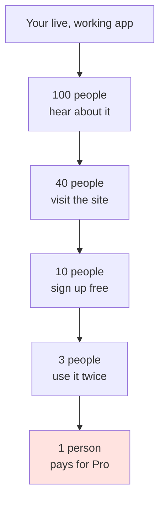
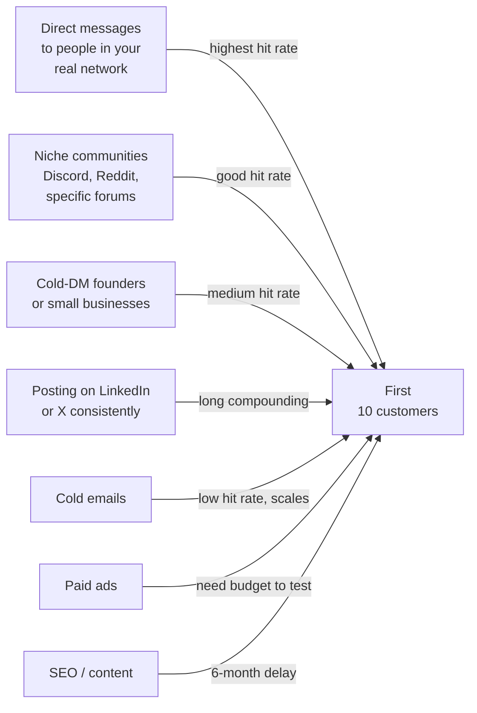
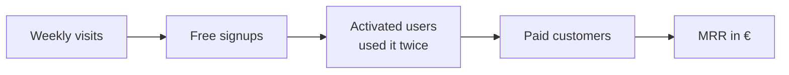

# Verkaufen — First customers

The chapter most "I built a SaaS" people skip, and the reason 95% of indie apps die at 0 customers. You built the thing. Now the harder, more interesting work begins.

Plan: read this chapter once, then return to it weekly for your first three months.

---

## The first-customer funnel



The numbers above are honest for a brand-new indie SaaS without an audience. Don't be discouraged by the funnel — be respectful of it. Every step is its own art.

Your job for the first 3 months: **fill the top of this funnel** with people who fit your real target. Don't chase volume. Chase relevance.

---

## Where first customers actually come from

In order of how much they actually work for a 17-year-old indie founder in Austria:



**Start at A. Always.** Your warm network beats every cold channel for first customers.

---

## Pricing — start here, adjust later

If unsure, default to this:

| Tier | Price | What's in it |
|---|---|---|
| Free | €0 | Limited usage (e.g. 3 habits, 1 essay) |
| Pro | €7/mo or €70/yr | Unlimited usage, AI features, analytics |
| Team | €19/mo | Multi-tenant, 5 seats |

Three reasons:

1. **€7 is the "no-think" price.** Cheaper than a coffee per week. Customers don't agonise.
2. **Annual at 17% discount** is psychologically powerful and gives you cashflow.
3. **Team tier exists even if no one buys it.** Anchoring effect — makes €7 look like a bargain.

Raise prices on round 2, after first 10 customers. Never on round 1.

---

## Übung 1 — Write your one-pitch (45 min)

**Deliverable:** a single-sentence pitch saved to your portfolio.

Every freelancer and founder needs to introduce their product in one sentence, at a party, in 8 seconds. Write yours now.

The formula:

> [What it is] for [who] that [the unique benefit].

Example:

> Schritte is a quiet habit tracker for adults who've tried 5 gamified apps and quit them all.
>
> TutorBuch is a booking and payment app for private tutors in DACH who currently lose hours to WhatsApp scheduling.
>
> Aufsatz-Helfer is an AI essay reviewer for Austrian Gymnasium students that grades like a real Austrian teacher would.

Write 5 versions of yours. Pick the one that sounds least like a startup pitch. Save the winner as `lehre-1/sales/one-pitch.md`.

✅ Stop when you've chosen one and saved it.

---

## Übung 2 — The list of 30 (60 min)

**Deliverable:** a list of 30 real human names in your network who could need your product.

Open your phone. Open Instagram. Open WhatsApp. Open your school class list.

For your product, write down 30 specific people who might genuinely benefit:

**For Aufsatz-Helfer (essay helper):** every classmate of yours at *Gymnasium*. Every cousin in school. Every friend's older sibling who's done Matura recently.

**For Schritte:** anyone you know who's tried fitness apps, journaling, or habit tracking. Adults more than teens.

**For TutorBuch:** every tutor or private teacher in your extended family + your parents' circle.

Save the list as `lehre-1/sales/list-of-30.md`. **Real names. Real people.** No vague categories like "students."

✅ Stop when you have 30 specific names.

---

## Übung 3 — The personal-DM template (30 min)

**Deliverable:** a friendly DM template you can copy-paste 30 times.

The template that works (don't get cute, use exactly this format):

```
Hey [name] 👋

I built a little thing — [your one-pitch].

I'm trying to find 10 people willing to use it 
for free for a month and tell me honestly 
whether it sucks or helps. No catch, no sales 
pitch — I just want feedback from real people.

Want in? It takes 60 seconds to sign up: [link]
```

This works because:

- Personal and casual, not "Hi friend, are you familiar with our new SaaS"
- Asks for *feedback*, not *money* — humans love to give feedback, hate being sold
- Free, time-limited, low stakes
- Specific number (10 people) makes it feel exclusive

Save your version as `lehre-1/sales/dm-template.md`.

✅ Stop when you have a personal template ready to copy.

---

## Übung 4 — Send 10 real messages today (45 min)

**Deliverable:** 10 messages sent to 10 real humans.

This is the hardest Übung in the entire Lehre. Not because it's complex — because it's uncomfortable.

Take 10 names from your List of 30. Send each one a personalised version of your DM. Personalise by:

- Mentioning a specific reason they came to mind ("you mentioned hating your habit app last week," "you told me you have to mark 30 essays this weekend")
- Using their real name and a recent shared moment
- Keeping it under 80 words

Then close the app. Don't refresh.

In 24 hours, count: how many replied? How many signed up? Save the count as `lehre-1/sales/round-1-results.md`.

A normal hit rate is **3 out of 10 will reply** and **1 of those will sign up**. That's success. If you got 1 signup from 10 DMs, you have product-market-friend-fit. Repeat 3 more times = 4 customers from 40 friends.

✅ Stop when 10 messages are sent. Open the app tomorrow to count.

---

## Übung 5 — The Loom in lieu of a sales call (45 min)

**Deliverable:** a 4-minute personalised Loom for one warm prospect.

For one prospect who replied but hasn't signed up yet, record a Loom showing you using **their version** of your app. For Aufsatz-Helfer, record yourself pasting an essay similar to theirs and showing the feedback. For Schritte, record yourself adding the exact habits you know they'd track.

Personal demo Looms convert 30%+ of warm leads. They take 4 minutes to make and feel impossibly thoughtful to the receiver.

Save the Loom URL. Send to them.

✅ Stop when you've sent a personalised Loom to one warm lead.

---

## Übung 6 — Communities (60 min)

**Deliverable:** identified 3 communities where your target hangs out, lurked for 1 hour total.

For each of your three picks:

**For Aufsatz-Helfer:**
- r/Austria, r/Wien, r/Gymnasium
- Discord servers for *Matura* prep
- Facebook groups for Austrian parents

**For Schritte:**
- r/getdisciplined, r/productivity
- Habit-tracking subreddits
- Indie wellness Twitter

**For TutorBuch:**
- Austrian tutor associations
- WhatsApp groups for music teachers (your mum probably knows some)
- Facebook groups for private teachers

**Don't post yet.** Lurk for at least an hour each. Read what real people complain about. Take notes. The exact words they use become your future ad copy, landing-page headlines, and product features.

After 3 hours of lurking, save `lehre-1/sales/community-notes.md` with what you observed.

✅ Stop when you have notes from 3 communities.

---

## Übung 7 — One useful Reddit comment (30 min)

**Deliverable:** one helpful, non-promotional comment posted in a relevant subreddit, with at least 1 upvote.

In one of the communities from Übung 6, find a recent post where someone has the exact problem your product solves. Reply with a genuinely useful answer — **don't mention your product.** Just help.

Examples:

- Someone in r/getdisciplined: *"I've tried 5 habit apps and quit them all"* → reply with what you've learned about why most fail (gamification fatigue, broken streak guilt). No link to Schritte.

- Someone on r/Austria: *"Wie bekomme ich Feedback auf meinen Aufsatz?"* → reply with what you've learned about good essay structures for Matura. No link to Aufsatz-Helfer.

Why no link? Because the reputation you build by being helpful *without selling* converts 10x better when you later post a small *"I built this, link in profile"* mention. The community trusts you first.

✅ Stop when you've made one helpful comment with at least one upvote.

---

## The numbers to track from day one



Write down these 5 numbers every Friday for the first 12 weeks.

You'll learn that the funnel widens at the bottom over time. Visits stay flat for months, but signups → activated → paid creeps up as you improve onboarding and the product.

Track in a simple Google Sheet: `lehre-1/sales/weekly-metrics.xlsx`. One row per Friday.

---

## Übung 8 — Set up the metrics sheet (15 min)

**Deliverable:** a metrics tracker with at least the first row filled in.

Make a Google Sheet with columns:

| Date | Visits | Signups | Activated | Paid | MRR (€) | Biggest change this week |
|---|---|---|---|---|---|---|

Fill in row 1 today, even if all the numbers are 0. The habit of writing them down is more important than the numbers themselves.

✅ Stop when row 1 exists.

---

## Meisterstück for this chapter

- [ ] One-pitch saved (Übung 1)
- [ ] List of 30 real names (Übung 2)
- [ ] DM template ready (Übung 3)
- [ ] 10 real DMs sent (Übung 4)
- [ ] One personalised Loom sent to one warm lead (Übung 5)
- [ ] Community notes from 3 places (Übung 6)
- [ ] One useful, non-promotional reply with at least 1 upvote (Übung 7)
- [ ] Metrics sheet started (Übung 8)

**Loom (3 min):** record yourself walking through your metrics sheet, explaining what each column means, the rate at each step of your funnel, and what you'd change to improve the weakest step. Save to `portfolio/lehre-1/verkaufen-meisterstueck.mp4`.

This Loom is the one that gets you hired as a freelance growth person, not just a developer. Founders love hearing developers who think about funnels.

---

## Lehrling Notiz

Selling feels gross the first 10 times. It stops feeling gross around DM 11. By DM 50 it feels like the most natural thing in the world. You will hit a moment around DM 6 where you'd rather refactor 1000 lines of code than send one more message. Send it anyway. The shame fades. Five minutes after sending you'll be sad you waited a week to do it.

The one thing nobody tells beginners: **selling is the most leveraged skill in any business.** A 10% better product gets you 10% more customers. A 100% better sales process gets you 10x more. The cap on what you can build is your skill at building. The cap on your *income* is your skill at telling people about it.
