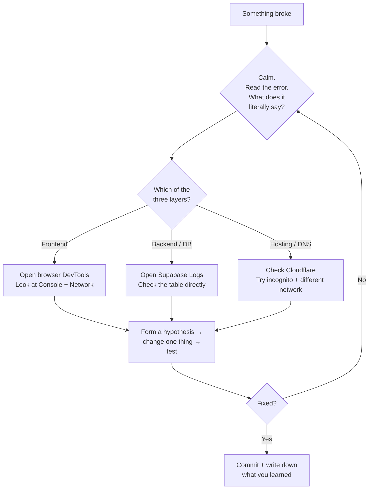

# Werkzeugkasten — Debugging

A reference chapter, not a weekly Lehrling. Come back to it every time something breaks. Save this in your bookmarks.

---

## The Lehrling debugging mindset



The single most senior thing you can learn: **slow down and read the error literally.** 90% of bugs reveal themselves when you read the message in plain English instead of skimming.

---

## The 7-step debugging checklist

For every bug, walk through these in order. Most bugs are fixed by step 3.

**1. Refresh.** Cold reload (`Cmd + Shift + R`). Sometimes the bug is a stale cache.

**2. Try a different browser or incognito mode.** Confirms it's not local to your setup.

**3. Read the actual error.** Open DevTools (right-click → Inspect → Console). Read **every** error literally. Not skim — *read*.

**4. Search the exact error string.** Paste it into Google or Claude. Most errors have been hit by 10,000 people before you.

**5. Form a hypothesis.** Write it down in plain English: *"I think X is happening because Y."* Don't change anything yet.

**6. Change one thing, test.** Not three things. One. If it didn't fix the bug, undo before changing the next.

**7. Write down what fixed it.** Even if you didn't understand fully — a one-line note in a `bugs-fixed.md` file. Six months from now you'll hit the same bug again and your notes will save you an hour.

---

## The "I'm stuck-stuck" universal prompt

Paste this into Claude Code or Lovable when the easy steps haven't worked:

```
I'm stuck. Here's what's happening:

[paste the error or describe the bug in 1-3 sentences]

What I've tried:
1. [thing 1]
2. [thing 2]
3. [thing 3]

What I expected to happen:
[describe expected behaviour]

What's actually happening:
[describe actual behaviour]

Don't write code yet. First, in plain English:
1. What do you think is causing this?
2. What additional info would help confirm?
3. What's the cheapest experiment to test your theory?
```

This prompt fixes bugs faster than just throwing the error at AI and saying "fix it." Because it forces both you and Claude to *think first.*

---

## Most-common bug patterns + fixes

A table you'll refer to a hundred times.

| Bug pattern | Where | Most common cause | Fast fix |
|---|---|---|---|
| Page is blank, console error about a hook | Frontend | React hook order changed or component unmounted while async | Look at the line in the error; check for missing `useEffect` cleanup |
| Data doesn't appear after add | Frontend or RLS | RLS policy not letting user read their own row | Check the Supabase policy `USING (auth.uid() = user_id)` |
| Form submits, network shows 401 | Backend | User not logged in or token expired | Check Supabase Auth state before the API call |
| Form submits, network shows 403 | Backend | RLS denying the action | Open Supabase → Auth → Policies; review the policy for the table |
| Form submits, network shows 500 | Backend | Server-side function error | Open Supabase Logs (Edge Functions or Postgres Logs) |
| `Failed to fetch` in browser | Frontend or hosting | API endpoint wrong or CORS issue | Compare URL in code vs URL in browser network tab |
| Site works on laptop, broken on phone | Frontend | Mobile viewport or touch event | Open DevTools mobile preview, check for horizontal scroll or hover-only interactions |
| Stripe webhook never fires | Hosting | Webhook URL wrong or no signature verification | Check Stripe Dashboard → Webhook attempts log |
| Email never arrives | External | Domain not verified at Resend, or in spam | Check Resend dashboard logs |
| Page loads slowly | Performance | Unoptimised images or render-blocking JS | Lighthouse → click each issue → fix one at a time |

---

## The security never-skip checklist

Every time you ship a change that touches user data, run through this. Not optional.

- [ ] **RLS enabled** on every table that holds user data
- [ ] **RLS policies use `auth.uid()`** to scope to current user (or `auth.uid() in (select user_id from team_members where team_id = ...)` for multi-tenant)
- [ ] **No secrets in client code** — no API keys, no service-role keys, no admin tokens in anything that ships to the browser
- [ ] **Server-side checks for auth** — never trust the client to say "I'm an admin"
- [ ] **Sanitised user input** — if you accept rich text or HTML, use a library to strip dangerous tags
- [ ] **Rate-limit AI calls** by user — otherwise one bad actor can drain your Anthropic credits
- [ ] **HTTPS everywhere** — never send forms over HTTP

If you skip this list once, you'll regret it. There's no second chance once user data has leaked.

---

## How to log a bug for future-you

Maintain a single file: `lehre-1/bugs-fixed.md`. Every meaningful bug gets a 3-line entry:

```markdown
## 2026-05-12 — Habit list showed empty after add
- Cause: RLS policy on habit_completions didn't include INSERT for auth.uid()
- Fix: added INSERT policy in Supabase
- Lesson: when adding a table, always set policies for all 4 operations (SELECT/INSERT/UPDATE/DELETE)
```

Six months from now, search this file. You'll find your own answer to the same bug you forgot you fixed.

---

## When AI gets you stuck, not unstuck

A real failure mode: you ask Claude to fix something, Claude makes it worse, you ask Claude to fix that, things spiral. After 4 rounds of this, **stop.**

Recovery moves, in order:

1. **`git checkout .`** — discard all uncommitted changes. Start fresh from your last working commit.
2. **Read what Claude actually changed** before reverting — sometimes there's a useful idea buried in the mess.
3. **Switch tools.** If Lovable spiralled, try Claude Code. If Claude Code spiralled, try doing it in Lovable. Different tools have different blind spots.
4. **Ask a human.** Send your dad a Loom. He can usually spot what's wrong in 5 minutes from outside the spiral.

---

## The README habit

Every project should have a `README.md` at the root that you maintain forever.

Template:

```markdown
# Schritte

A quiet habit tracker with a weekly AI coach.

## Stack
- Frontend: React + Vite + Tailwind, hosted on Lovable
- Backend: Supabase (auth + Postgres + Edge Functions)
- AI: Anthropic API (claude-sonnet-4-5)
- Payments: Stripe (Pro subscription)
- Emails: Resend
- Analytics: Plausible

## Important secrets (in Lovable + Supabase env vars)
- STRIPE_SECRET_KEY
- STRIPE_WEBHOOK_SECRET
- ANTHROPIC_API_KEY
- RESEND_API_KEY

## How to run locally
1. git clone
2. npm install
3. cp .env.example .env  (then fill in keys)
4. npm run dev

## Architecture decisions worth remembering
- All data scoped by `user_id` via RLS, never by app code
- AI weekly review cached for 7 days per user
- Stripe webhooks at /api/stripe-webhook

## Known issues
- (none, but list them here as they appear)
```

Update this file every time you make a non-obvious decision. It's the gift your future self will thank you for.

---

## Lehrling Notiz

The single difference between a junior dev and a senior dev isn't speed. It's *calm under bugs.* Juniors panic and try 5 things. Seniors read the error twice, form one hypothesis, test it, and most of the time fix the bug in 10 minutes flat.

Calm comes from having debugged hundreds of bugs. There's no shortcut. But this chapter is the closest thing — it speeds up the first hundred. Read it. Bookmark it. Come back to it every time something breaks.
