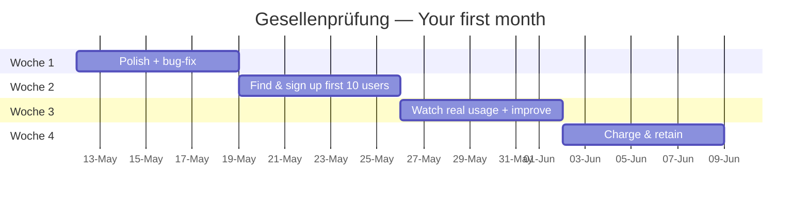
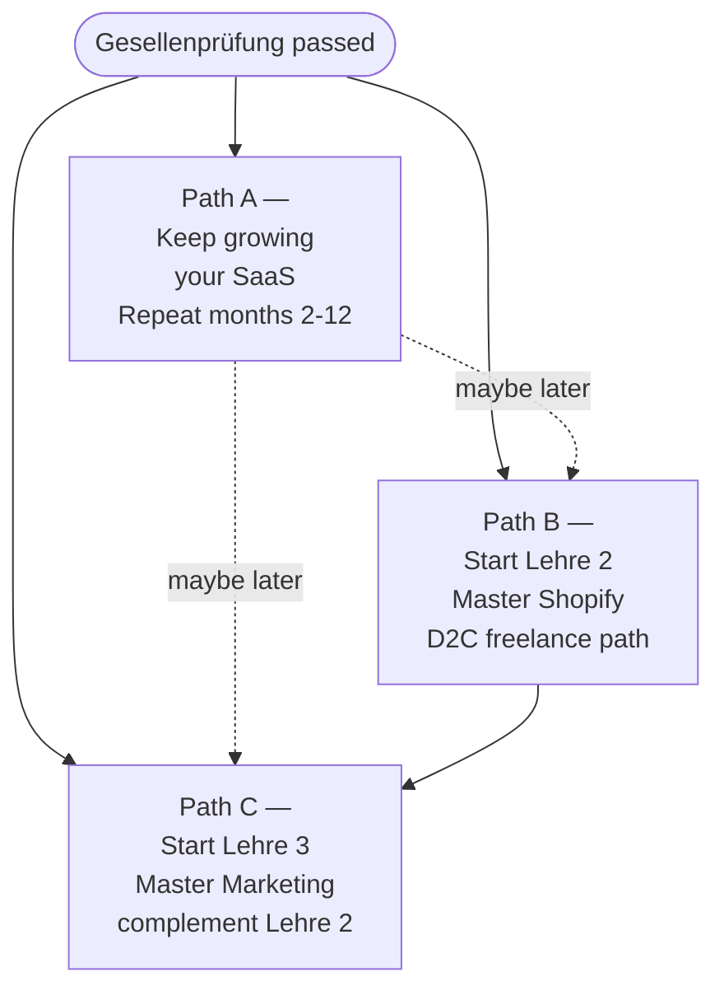

# Gesellenprüfung — Your first month

The final test of Lehre 1. A *Gesellenprüfung* in Austria is what an apprentice does at the end of their training to become a *Geselle* (journeyman). Here's yours.

The Gesellenprüfung isn't a quiz. It's a structured first month with **specific deliverables you can show off.** Complete it and you have undeniable evidence that you can build a real SaaS, find real customers, and learn from real data.

Plan: **4 weeks**, ~2 hours per day.

---

## The four-week shape

You'll spend less than 5% of this month writing new features. The rest is finishing, distribution, and learning. That ratio is the real first-month-of-business pattern.

---

## Woche 1 — Polish & close gaps

**Goal:** zero embarrassing rough edges. The app feels finished, not "finished by an apprentice."

### Daily tasks

**Monday — Audit your live app.** Open it on three devices: your phone, your laptop, and a friend's phone. Visit every page. Click every button. Make a list of every rough edge, broken state, or moment of confusion. Aim for 20+ items.

**Tuesday — Fix the 10 worst.** Don't try to fix all 20. Pick the 10 that most break trust. Spacing issues, broken loading states, error messages that are scary, copy that sounds AI-written.

**Wednesday — Empty-state polish.** Every list and dashboard has an "empty" state. New users see them first. Make each one warm, friendly, and tell the user exactly what to do next.

**Thursday — Onboarding pass.** Sign up as a brand-new user (different email) and time yourself. How many seconds until you understand what to do? Anything over 30s is too long. Cut steps. Add inline hints. Make the first habit / first booking / first essay feel inevitable.

**Friday — Mobile final pass.** Walk through everything on iPhone SE in DevTools. Every form, every modal, every menu. Fix any cramped layouts.

**Saturday — Pre-launch checklist.** Run through the full list from chapter 8.

**Sunday — Loom your tour.** Record a 3-minute Loom walking through your live app from a customer's POV. Save to `portfolio/lehre-1/gesellenpruefung/woche-1-tour.mp4`.

### Woche 1 Meisterstück

- [ ] All 10 worst rough edges fixed
- [ ] Every empty state is warm and useful
- [ ] First-time user onboarding is under 30 seconds
- [ ] iPhone SE shows zero horizontal scroll on any page
- [ ] Full pre-launch checklist green
- [ ] Tour Loom recorded

---

## Woche 2 — Find your first 10 users

**Goal:** 10 real humans signed up. Doesn't matter if free. Just real.

### Daily tasks

**Monday — Re-read chapter 10 (Verkaufen).** Open your List of 30. Tick names you've already messaged. Pick 10 more.

**Tuesday — Send 10 personalised DMs.** Use your template. Personalise each one. Send between 19:00 and 21:00 (highest reply rates).

**Wednesday — Reply to anyone who replied.** Don't pitch. Have a normal conversation. Show interest in their answer. Then send the signup link.

**Thursday — Post in 1 community.** From your 3 community list (Übung 6 in ch 10), pick the most relevant. Post a genuine help-first post — not a launch announcement. End with one casual line: *"PS I built a tiny thing for this if anyone wants to try — link in bio."*

**Friday — Personalised Loom day.** Pick the 3 most-likely-to-convert warm leads who replied. Record a 2-minute Loom for each, personalised. Send.

**Saturday — Walk + check metrics.** Open your metrics sheet. Update row 1. Notice patterns. Save a note: *"this week I noticed ___."*

**Sunday — One-on-one feedback call.** Get on a 20-minute video call with one early user. Ask: *"Walk me through how you used it. Where did you get stuck? What surprised you?"* Take notes.

### Woche 2 Meisterstück

- [ ] 10 personalised DMs sent
- [ ] At least 3 personalised Looms sent
- [ ] 1 community post made
- [ ] 1 user-feedback call completed
- [ ] Metrics sheet updated with this week's numbers
- [ ] At least 10 free signups (or notes on why the funnel is leaking)

---

## Woche 3 — Watch real usage, improve based on what you see

**Goal:** the app gets better based on real human behaviour, not your guesses.

### Daily tasks

**Monday — Read your analytics.** Open Plausible/Umami. What's the top entry page? Where do people drop off? What buttons get the most clicks? Take notes.

**Tuesday — Watch session recordings if available.** Use **Microsoft Clarity** (free) to record real user sessions. Watch 3 of them. You'll see things you've never noticed.

**Wednesday — Pick the #1 leak.** From analytics + recordings + the feedback call, pick the *single biggest* place where users drop off. Fix only that.

**Thursday — Ship the fix.** Make the change. Push it. Watch tomorrow's data to see if the leak narrowed.

**Friday — Send a "thanks + ask" email to early users.** Subject: *"Quick question + a thank-you."* Body: 3-line thanks for being an early user, one specific question (*"what's the one thing you wish the app did?"*). 30% will reply.

**Saturday — Improve based on the replies.** Pick the most-mentioned feature request. Don't build it yet — write a 1-page mini-spec for it.

**Sunday — Loom: what you learned this week.** Record yourself walking through your analytics dashboard, explaining what you saw, what you fixed, and what data you got back. Save to `portfolio/lehre-1/gesellenpruefung/woche-3-learnings.mp4`.

### Woche 3 Meisterstück

- [ ] Analytics reviewed every weekday
- [ ] At least 3 session recordings watched
- [ ] One specific funnel fix shipped based on data
- [ ] "Thanks + ask" email sent to all early users
- [ ] Mini-spec written for the most-requested feature
- [ ] Loom recorded

---

## Woche 4 — Charge & retain

**Goal:** at least 1 paying customer. Not for the money — for the proof that the model works.

### Daily tasks

**Monday — Add a soft paywall.** Make sure your free-tier limits actually bite. Users hitting the limit should see a friendly upgrade CTA (not a hard wall).

**Tuesday — Email all free users.** Personalised one-line message. *"Hey — you've been on Schritte for two weeks. Curious if it's been helpful? I'm running a launch deal — 50% off Pro for the first month if you want to try it. No pressure."*

**Wednesday — Reply to everyone who replied.** Be human. Some will buy. Some will ask questions. Some will say "not for me right now" — that's a learning, not a rejection.

**Thursday — Verify Stripe live mode end-to-end.** Get one real €3.50 (or full €7) charge through. Refund yourself afterwards if it's your own card. Watch the webhook fire and update the database.

**Friday — Audit retention.** For paid users (if any), make sure they actually use the app weekly. Send a friendly check-in. Retention is more important than acquisition once you have paying users.

**Saturday — The "what next" question.** Open a blank doc. Answer: *"If I were to spend the next 90 days only on this product, what 3 things would compound the most?"* Save as `portfolio/lehre-1/gesellenpruefung/next-90-days.md`.

**Sunday — Gesellenprüfung Final Loom.** Record a 5-minute Loom for your portfolio:
- Show the live product
- Show the metrics from week 1, week 2, week 3, week 4
- Show one paying customer (their row in Stripe Dashboard)
- Talk about one mistake you made and what you learned
- Mention what you'd do differently next time

Save to `portfolio/lehre-1/gesellenpruefung/final.mp4`. **This is the single most important video in your portfolio.** It's the proof you can do all of this end-to-end.

---

## What "passing" looks like

You pass your Gesellenprüfung if, at the end of the month, all of these are true:

- ✅ The app is live, polished, on a custom domain, with HTTPS
- ✅ At least 10 real humans have signed up (not bots, not your dad's three test emails)
- ✅ At least 1 paying customer (or you've gotten 3 *no-but-here's-why* answers, which is data)
- ✅ You've made at least 2 changes based on real user feedback
- ✅ You have a Loom that summarises the month
- ✅ You can explain your weekly metrics out loud, clearly, to someone who isn't technical

If 5 of 6 are true, you've passed.

If all 6 are true, you've **distinguished pass** — you are now significantly ahead of most working developers, who never sell anything they build.

---

## What comes after

You have three paths now. Pick one:

**Path A — Stay focused on your SaaS.** Months 2–12 are about going from 1 paying customer to 50. Most indie SaaS founders never push past this — the ones who do hit €5k+ MRR.

**Path B — Master Shopify.** Become a freelance D2C dev like Christa.dev. The skills compound on top of Lehre 1.

**Path C — Master Marketing.** Add the other half of every D2C business — paid ads, SEO, email, CRO. Best combined with Lehre 2 to charge premium rates.

Most people end up doing all three. There's no rush. You're 17.

---

## Lehrling Notiz

The moment you pass Gesellenprüfung is real and matters. Mark it. Take yourself out for *Sachertorte und Kaffee* and call your dad. You went from "I've never built anything" to "I run a real, live, paying-customer SaaS" in 8 weeks plus 1 month of distribution. That's not normal. That's a thing 99% of people who say they want to build something never actually do.

I'm proud of you, no matter what comes next.

— Pabbi
