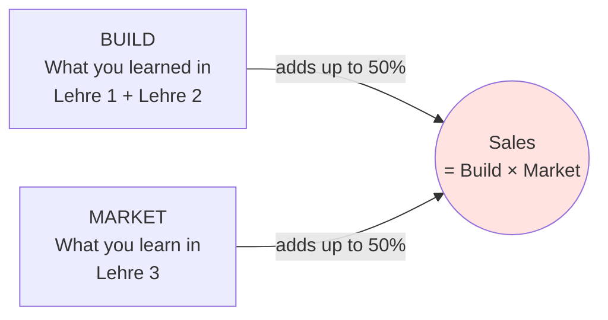
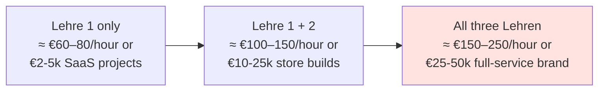
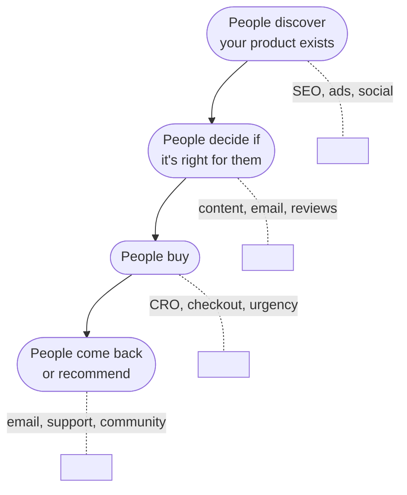
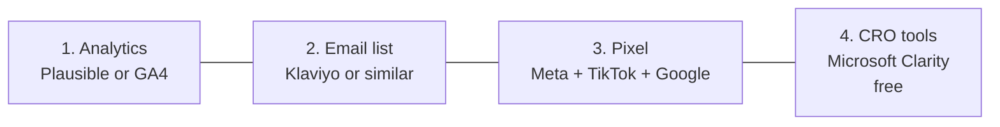

# Why marketing closes the loop

Welcome to your third Lehre. Six weeks. The most underrated half of every D2C business.

You know how to build a website (Lehre 1). You know how to build a Shopify store (Lehre 2). Now you'll learn the part that turns *"I built a store"* into *"I built a store that sells €40,000/month."*

Plan: this chapter is reading only. Six weekly Wochen start in chapter 21.

---

## The two-half truth of D2C

Most people learn one half and stop. Developers obsess over the build. Marketers obsess over the funnel. Both groups complain the other side is wrong.

**Christa.dev** charges €15k–€30k for a Shopify build. The brands that hire her have **already spent more than that** on paid ads, content, influencers, and email — to drive traffic to the new store she builds.

If you only build, you compete with every freelance dev in DACH.

If you only market, you depend on a developer to ship anything.

**If you do both,** you're the rarest, most expensive freelancer in your niche. You're also someone who can build their own brand from zero to revenue without hiring anyone.

---

## What you'll learn in six weeks

**Woche 1 — Understand the customer.** Personas, analytics, customer research. The foundation. Skipped by 90% of marketers. Why they all run mediocre campaigns.

**Woche 2 — SEO.** Technical SEO, content SEO, the AI shift (LLM-optimised content). Real audit drills on real sites.

**Woche 3 — Paid ads.** Google Ads, Meta Ads, TikTok Ads. Run real campaigns with a tiny budget (€30/day). See what burns money and what scales.

**Woche 4 — Email automation.** Welcome flows, abandoned cart, win-back. Klaviyo for D2C. Where 30% of D2C revenue actually comes from.

**Woche 5 — Deep CRO.** A/B testing, heatmaps, session recordings, the real funnel surgery that doubles conversion rates without more traffic.

**Woche 6 — Gesellenprüfung.** Do a real growth audit on a real brand. Deliver actionable recommendations as if to a paying client. Add to portfolio.

---

## What you'll be able to charge after this Lehre

Numbers are based on real DACH freelancer rates in 2026. Real ones. People with all three skills are the ones charging at the top of these ranges, regularly. You're not capped by talent. You're capped by skill *combinations*.

---

## The marketing mental model

Marketing is one diagram.

Four stages. Different tools and tactics for each. The whole Lehre walks you through each stage.

A common beginner mistake: confusing the stages. Running brand awareness campaigns when the real problem is checkout converts at 1%. Running CRO drills when nobody's even arriving at the site yet.

**Diagnose before prescribing.** Always.

---

## The minimum-viable marketing setup

For every brand you'll work with — including your own — these four things have to be in place before any tactic works.

Missing any of these, and you're flying blind. **Setting up these four is half of what we'll cover in week 1.**

---

## Three myths to unlearn before you start

**Myth 1 — "Marketing is for extroverts."**
Reality: the best marketers are introverts who like spreadsheets. The job is mostly looking at data and writing copy, both quiet work.

**Myth 2 — "More traffic equals more sales."**
Reality: a 2x improvement in conversion rate is worth more than 10x more traffic. Most brands don't have a traffic problem; they have a funnel problem.

**Myth 3 — "Paid ads are the answer to everything."**
Reality: paid ads work for brands that already have strong organic signals (good reviews, repeat purchase rate, decent conversion rate). For new brands, paid ads light money on fire. Earn the right to paid ads.

Hold these in mind every week.

---

## What you'll need this Lehre

- A **real brand** to practice on. Options:
  - Your own product from Lehre 1
  - Your Lehre 2 fake brand (Kornfeld, Murmel, Saumtier) given a real domain
  - A small business owner in your network who'll let you experiment
  - A real Shopify store with a public URL — pick one from Christa.dev's portfolio (Findling, Bergmensch, Health Routine etc.) to practise audits on, *without* contacting the brand
- A small **ad budget** for week 3 — €100–300 total over 1 week to actually run real campaigns
- A **Klaviyo free account** for week 4
- A **Microsoft Clarity** free account for week 5

We'll set these up as we go.

---

## The pre-Lehre Übung

**Übung — Bookmark these (10 min)**

Spend 10 minutes opening these tabs and bookmarking each into a "Marketing" folder:

- `plausible.io` — privacy-first analytics
- `analytics.google.com` — Google Analytics 4
- `ads.google.com` — Google Ads
- `business.facebook.com` — Meta Business
- `ads.tiktok.com` — TikTok Ads
- `klaviyo.com` — email automation
- `clarity.microsoft.com` — free session recordings
- `ahrefs.com/free-seo-tools` — keyword research (some free)
- `marketingexamples.com` — copywriting case studies
- `goodemailcopy.com` — email copywriting examples

You'll use most of these every week.

✅ Stop when bookmarks are in place.

---

## Lehrling Notiz

If you read each weekly chapter and **don't run the actual campaigns**, you'll learn nothing. Marketing is a hands-on craft. The Wochen here aren't theoretical — each one ends with real data from real ads or real audits, that you've personally run.

Budget €100–€300 of "tuition" for the paid-ads week. The data you get back is worth €5,000 in formal classroom education. Don't skip it.

See you in Woche 1.
