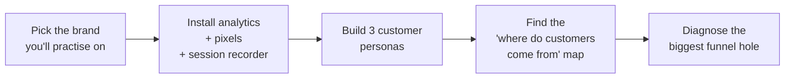
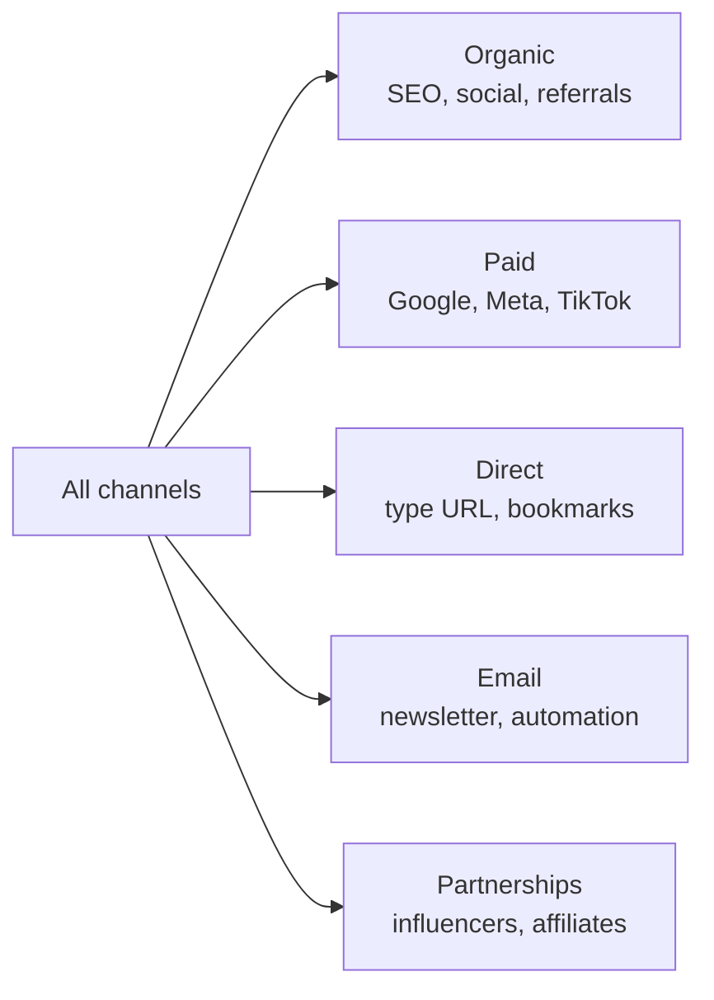
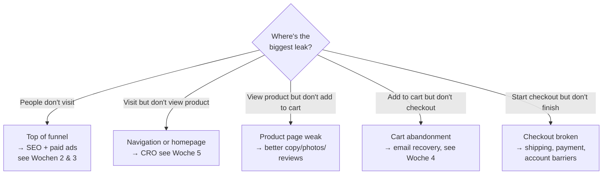

# Woche 1 — Understand the customer

The foundation. Skip this week and every other week of Lehre 3 falls flat. Most people skip it, which is exactly why most marketing campaigns are mediocre.

Plan: **4–5 hours** across 3 sessions.

---

## What this week covers



By Friday you'll know more about your target brand's customer than 80% of the brand's own staff.

---

## Übung 1 — Pick a brand and set the goal (20 min)

**Deliverable:** a one-page brief about the brand you'll practise on for the next 6 weeks.

Pick **one** of:

- Your own Lehre 1 SaaS
- Your Lehre 2 fake brand made into a real domain
- A small business in your real network who'd let you experiment
- A publicly available D2C brand to *audit* (no live testing, just analysis)

In a file `lehre-3/woche-1/brand-brief.md`, fill in:

```markdown
# Brand: [name]

**One-line pitch:** [from chapter 10]

**Current monthly traffic:** [estimate from similarweb.com or Plausible if you have access]

**Current monthly revenue:** [if known]

**Average order value (AOV):** [if known]

**Conversion rate:** [visits → buyers, if known]

**The one most-important growth goal for the next 90 days:**
  e.g. "go from 100 → 500 monthly orders without raising AOV"
  e.g. "double email-driven revenue from 5% to 10% of total"

**Why it matters to me:** 
  [your honest reason]
```

✅ Stop when the brief is saved.

---

## Übung 2 — Install analytics (45 min)

**Deliverable:** your brand has real analytics flowing in.

You can't improve what you don't measure. **Every** brand you ever work with needs this on day one.

**Step 1 — Plausible (recommended) or GA4.**

Plausible:
- Sign up at **plausible.io**
- Add your domain
- Copy the script tag
- Paste it into your `<head>` (in Lovable: just prompt *"Add this script tag to the head of every page: [paste]"*)

GA4 (Google Analytics 4):
- Sign up at **analytics.google.com**
- Create a property
- Copy the GA4 measurement ID (`G-XXXXXXXXX`)
- Add the GA4 snippet to your site

Both work. Plausible is simpler and GDPR-friendly. GA4 is industry standard but heavier and needs a cookie banner in EU.

**Step 2 — Set up 5 custom events.**

The events to track on every site:

| Event | When it fires |
|---|---|
| `view_product` | User lands on a product page |
| `add_to_cart` | User clicks "Add to cart" |
| `start_checkout` | User clicks "Checkout" |
| `purchase` | Order completed |
| `signup` | New user account created |

In Lovable:

> Add tracking calls to fire these custom events through [Plausible / GA4]: view_product (on product page load), add_to_cart (on add-to-cart button click), start_checkout, purchase (on order confirmation page), signup (after successful registration). Use the Plausible custom events API or GA4 gtag('event', ...) syntax.

**Step 3 — Test it.**

Visit your live site from your phone. Click around. Add something to cart. After 5 minutes, check your analytics dashboard. You should see the events firing.

✅ Stop when at least 3 of the 5 custom events have shown up in your dashboard.

---

## Übung 3 — Install Microsoft Clarity (15 min)

**Deliverable:** session recordings flowing in for your live site.

**clarity.microsoft.com** is free, no payment ever. It records real user sessions — you watch them clicking, scrolling, getting stuck.

It's the single highest-ROI free tool in marketing. You learn more from 10 session recordings than from 10 hours of analytics.

- Sign up
- Add your site
- Paste their script into your `<head>`
- Wait an hour
- Check the dashboard — you should see at least one session

✅ Stop when one real session shows up in Clarity.

---

## Übung 4 — Watch 5 real sessions (30 min)

**Deliverable:** notes on 5 real user sessions, written like a detective's report.

Open Clarity. Filter for sessions over 30 seconds (skip the bouncing bots). Pick 5. For each, write:

```markdown
## Session 5
- Device: iPhone 13 / mobile / Vienna
- Time on site: 1m42s
- Pages: home → product page → cart → ❌ left at checkout
- What I noticed: hesitated on the shipping cost line for 12s
  before clicking "back to cart" and leaving
- Hypothesis: shipping cost surprised them. Either too high or
  not disclosed earlier.
- What I'd test: surface shipping cost earlier (on product page
  or in cart icon)
```

Save as `lehre-3/woche-1/session-notes.md`.

**This drill is the most direct empathy practice possible.** You see real humans, real frustration, real money walking out. Pick up the habit and do it weekly.

✅ Stop when 5 sessions are written up.

---

## Übung 5 — Build 3 personas (60 min)

**Deliverable:** three short, vivid persona cards for your brand.

Persona = a fictional but plausible customer who represents a real segment. The point isn't accuracy. The point is being specific enough that copy choices become obvious.

Bad persona: *"Women 25–45 interested in wellness."*

Good persona:

```markdown
## Anna — the lapsed wellness shopper

**Age, life stage:** 34, two kids (4 and 7), works part-time
in HR, husband works in a bank.

**Lives in:** Linz suburbs, drives an SUV, owns the house.

**Income:** ~€2400/month her, household ~€6500.

**Online life:** Instagram 30 min/day. Reads articles via 
Falter newsletter. Active in 2 Facebook groups: 
"Achtsame Mütter Oberösterreich" and her kids' school group.

**Pain points:** mornings are chaos. She tried 4 wellness 
apps in the last 2 years and quit them all. Feels guilty 
about the abandoned subscriptions. Wants something simple 
that fits into school-drop-off rhythm.

**What she'd actually pay for:** something that takes
under 5 minutes/day, doesn't need streaks, doesn't make 
her feel like a failure when she misses days.

**Where I'd find more of Anna:** wellness Facebook groups
for Austrian mothers, Instagram accounts she follows.
```

Build **three** like this — one for each of your brand's most plausible customer types. Save in `lehre-3/woche-1/personas.md`.

**Pro tip:** if you can name 3 real people who fit each persona, you've done it right. If you can't, you're being too generic.

✅ Stop when 3 detailed personas exist.

---

## Übung 6 — The "where do customers come from" map (45 min)

**Deliverable:** a map of every channel that delivers customers to your brand, in priority order.



In your analytics dashboard, look at **Sources** for the last 30 days. List every channel by traffic, then by *conversion rate*.

Build a table in `lehre-3/woche-1/traffic-map.md`:

| Channel | Visits/mo | Conv rate | Orders/mo | Honest assessment |
|---|---|---|---|---|
| Direct | 1,200 | 4% | 48 | Returning customers, healthy |
| Google organic | 2,800 | 1.2% | 34 | Brand searches mostly, no ranking for product terms |
| Instagram | 900 | 0.4% | 4 | Brand awareness, no commercial intent |
| Email | 320 | 8% | 26 | Strongest converter, smallest reach |
| Meta Ads | 0 | — | 0 | Not running yet |
| Google Ads | 0 | — | 0 | Not running yet |

The honest assessment column matters most. **Where's the easy 2x growth?**

✅ Stop when the map exists and one channel is highlighted as the priority.

---

## Übung 7 — The funnel-hole diagnosis (30 min)

**Deliverable:** identification of the single biggest leak in your brand's conversion funnel.

Open analytics. Get these 5 numbers for the last 30 days:

| Metric | Value | Industry benchmark |
|---|---|---|
| Visits | ? | — |
| `view_product` rate | ? | 60-80% of visits |
| `add_to_cart` rate | ? | 10-15% of product views |
| `start_checkout` rate | ? | 60-70% of carts |
| `purchase` rate | ? | 60-75% of checkouts started |

For each row, calculate the % vs the previous step. Compare to industry benchmark. The biggest gap = your leak.

Common diagnoses:



Save the diagnosis in `lehre-3/woche-1/diagnosis.md`. **This is your North Star for the rest of Lehre 3.**

✅ Stop when you've named the biggest leak.

---

## Meisterstück for Woche 1

- [ ] Brand brief saved (Übung 1)
- [ ] Analytics installed with 5 custom events firing (Übung 2)
- [ ] Microsoft Clarity installed (Übung 3)
- [ ] 5 session-recording notes saved (Übung 4)
- [ ] 3 detailed personas written (Übung 5)
- [ ] Traffic map built (Übung 6)
- [ ] Funnel-hole diagnosis written (Übung 7)

**Loom (3 min):** screen-record your traffic map and funnel diagnosis. Explain in plain language: where customers come from, where they leak, and which leak you'd tackle first. Save to `portfolio/lehre-3/woche-1-meisterstueck.mp4`.

This Loom is what a real growth consultant would deliver. You can charge €300+ for a 90-minute audit that produces this output. You're 17 and you just did it.

---

## Lehrling Notiz

You'll be tempted to skip this week and jump straight to "the fun stuff" (paid ads in Woche 3). Don't. The reason most paid ads fail is that the brand doesn't know who they're talking to or what's actually broken. Diagnosis before prescription. Always.
