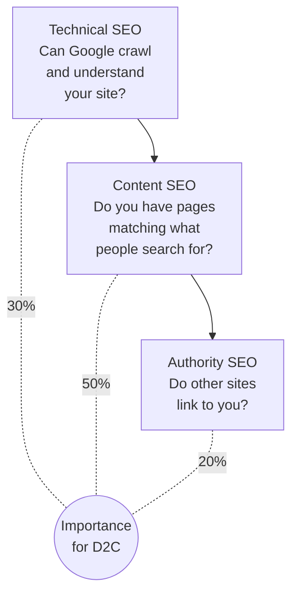
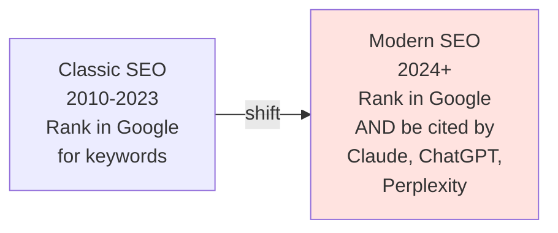
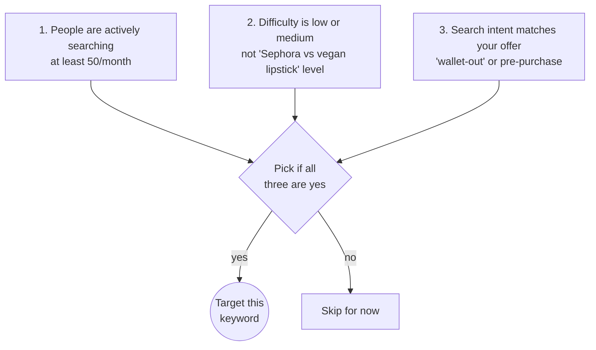
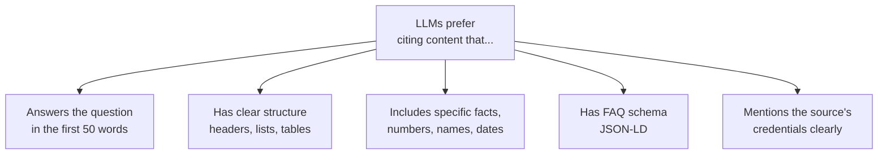

# Woche 2 — SEO that works

The slowest channel and the most defensible. Hardest to fake, hardest to copy. Once you rank, the traffic compounds while you sleep.

Plan: **5–6 hours** across 3 sessions.

---

## The three SEO layers



For a small D2C brand, **content is the biggest lever.** Most stores have OK technical and zero authority. The 50% win is writing 5 great pages targeting real searches.

---

## The shift you need to know about



**LLM-optimised content** is the new frontier. When someone asks Claude *"best vegetarian restaurants in Vienna,"* you want your client's site to be one of the cited sources. Same principles as SEO, slightly different tactics — we cover both this week.

---

## Übung 1 — Run a technical audit (45 min)

**Deliverable:** an audit report with the 10 most important technical issues + recommendations.

Use **ahrefs.com/site-audit** (free tier covers 5,000 pages) or **screamingfrog.co.uk/seo-spider** (free desktop tool, up to 500 URLs).

Crawl your brand's site. The most-common big issues to look for:

| Issue | What it means | Severity |
|---|---|---|
| Slow page speed | Pages load >3s on mobile | High |
| Missing meta descriptions | No `<meta name="description">` on pages | Medium |
| Duplicate titles | Two or more pages have same `<title>` | High |
| 404 errors | Internal links point to dead pages | High |
| Missing alt text | Images without descriptive `alt=""` | Medium |
| No `robots.txt` | Bots can't find sitemap | High |
| No `sitemap.xml` | Pages might not be discovered | High |
| No HTTPS | Site served over HTTP | Critical |
| Mobile usability fails | Text too small, buttons too close | High |
| No structured data | No JSON-LD for Product, Article, etc. | Medium |

Document each issue you find in `lehre-3/woche-2/technical-audit.md`. For each, write:

- The issue
- Where it appears (specific URLs)
- The severity
- The exact fix

✅ Stop when you've documented 10+ issues with fixes.

---

## Übung 2 — Keyword research the modern way (60 min)

**Deliverable:** a keyword map with 20 target searches and difficulty estimates.

Tools:

- **ahrefs.com/free-keyword-generator** — free, limited but useful
- **Google Search Console** — connect your site, see what you already rank for
- **Ask Claude directly** — paste your product + audience + ask for 20 keyword ideas
- **AnswerThePublic.com** — see the questions people search

For your brand, generate three lists:

**1. Money keywords** — searches by people ready to buy.
- e.g. *"vegetarian restaurant 1010 Wien"*
- e.g. *"online tutor Mathematik Matura"*
- e.g. *"habit tracker without streaks"*

**2. Top-of-funnel keywords** — people not ready to buy but in the right ecosystem.
- e.g. *"how to start a habit"*
- e.g. *"Matura preparation tips Austria"*
- e.g. *"vegan brunch Vienna 7th district"*

**3. AI-discovery keywords** — exact phrasings someone might ask Claude/ChatGPT.
- e.g. *"What's the best vegetarian restaurant in Vienna for a quiet Sunday brunch?"*
- e.g. *"Recommend a habit tracking app that doesn't gamify everything"*

For each, estimate:

- Monthly search volume (use ahrefs' free tool or just guess for now)
- Difficulty (low/medium/high)
- Intent (informational/transactional)

Save as `lehre-3/woche-2/keyword-map.md` — at least 20 keywords across the three buckets.

✅ Stop when 20 keywords are mapped.

---

## Übung 3 — Pick 3 to actually rank for (15 min)

**Deliverable:** 3 keywords picked, justified, written down.

You don't pursue 20 keywords. You pursue 3 well.

Use the **SEO sweet spot rule**:



Pick 3. Justify why each in 2 lines. Save to `lehre-3/woche-2/3-keywords.md`.

✅ Stop when 3 keywords are committed.

---

## Übung 4 — Write the #1 SEO page (90 min)

**Deliverable:** a real page on your brand's site, optimised for one chosen keyword.

For your highest-priority keyword, write a comprehensive page. The structure:

```markdown
# [H1 with the keyword, written like a human would say it]

[Opening paragraph — 2-3 sentences answering the search 
in the first 30 words. This is what Google's AI overview 
will quote and what Claude will cite.]

## [H2 covering subtopic 1 in the keyword's intent]

[Paragraph + bullet list. Include the keyword variants naturally.]

## [H2 covering subtopic 2]

[Real specifics. Photos if relevant. Lists.]

## [H2 covering subtopic 3 — often "comparison" or "how to"]

[Tables work great here.]

## Frequently asked questions

**[Question someone actually asks?]**
[Direct answer in 2-3 sentences. This is what LLMs cite.]

**[Second question]**
[Direct answer.]

[3-5 FAQs total]

## [Closing CTA — link to the product page]
```

The page needs:

- **At least 800 words.** Shorter pages don't rank for serious keywords.
- **Real-world specifics.** Names, places, numbers, photos. Not generic.
- **Schema markup.** Ask Lovable: *"Add JSON-LD FAQPage schema based on the FAQ section."*
- **Internal links** to 3 other pages on the site.
- **One real outbound link** to a high-authority source (e.g. an academic page, a government site, Wikipedia).

Save the URL of the live page in `lehre-3/woche-2/seo-page-1.md`.

✅ Stop when the page is live on your brand's site.

---

## Übung 5 — LLM optimisation drill (45 min)

**Deliverable:** the same page made citable by AI assistants.

LLMs cite content with these characteristics:



Rewrite the opening of your SEO page so it follows the **inverted pyramid** style:

```markdown
# What's the best [thing] for [audience]?

The best [thing] for [audience] is [specific answer]. 
For most people, this means [specific recommendation]. 
[Optional: counter-case for a specific exception.]

## Why? [Explanation, 2 paragraphs]
...
```

Then ask Claude or ChatGPT the exact question your page targets. Does it cite you? If not, what was different about the cited sources?

Iterate until your page either gets cited, or you understand exactly why the cited ones win (so you can improve).

✅ Stop when you've tested the AI-citation drill at least once and improved the page based on the result.

---

## Übung 6 — Get one real backlink (60 min)

**Deliverable:** at least one new backlink from a real third-party site.

Backlinks (other sites linking to yours) are 20% of SEO. Getting your first is the hard part.

The easy-to-get backlink sources:

1. **Industry directories** — DMOZ-style listings for your niche. (E.g. for an Austrian Shopify brand: *Wirtschaftsverband Österreich, FirmenABC.at, ihre-stadt.at*.) Submit your site.
2. **Reciprocal local listings** — friend's site, mentor's site, your school newspaper online (if they have one).
3. **Substack newsletters** — write a guest piece for a Substack in your niche. Author bio includes your link.
4. **HARO (Help A Reporter Out)** — journalists ask for sources, you reply with a quote. Free backlinks from major publications.
5. **Reddit AMA mentions** — when relevant, with the link in your bio (not the comment).

For week 2, just aim for **one**. Document the URL in `lehre-3/woche-2/backlinks-earned.md`.

✅ Stop when one real backlink exists pointing to your brand.

---

## Übung 7 — Set up Google Search Console (15 min)

**Deliverable:** GSC connected, sitemap submitted.

- Go to **search.google.com/search-console**
- Add your domain (verify via Cloudflare DNS)
- Submit your `sitemap.xml`
- Set up email alerts for big drops

Within a week, you'll start seeing which queries your site shows up for. Within 4 weeks, you'll have actual click data. This is the most undervalued free tool in SEO.

✅ Stop when GSC shows your site is verified and the sitemap is processed.

---

## Meisterstück for Woche 2

- [ ] Technical audit document with 10+ issues (Übung 1)
- [ ] Keyword map with 20+ keywords (Übung 2)
- [ ] 3 target keywords picked (Übung 3)
- [ ] One live SEO-optimised page (Übung 4)
- [ ] LLM-citation drill done (Übung 5)
- [ ] One backlink earned (Übung 6)
- [ ] Google Search Console connected (Übung 7)

**Loom (3 min):** walk through the SEO page you wrote, explain how it's optimised for both Google and AI assistants, and show your keyword map. Save to `portfolio/lehre-3/woche-2-meisterstueck.mp4`.

---

## Lehrling Notiz

SEO results take 3–6 months. You'll write a perfect page this week and see almost no traffic next week. That's normal. Don't quit because of the delay. The page you wrote will be earning the brand €€€ in month 7, when paid ads stopped working because the budget ran out.

The freelancers who *only* do paid ads chase volume forever. The ones who layer SEO on top sleep better at night.
