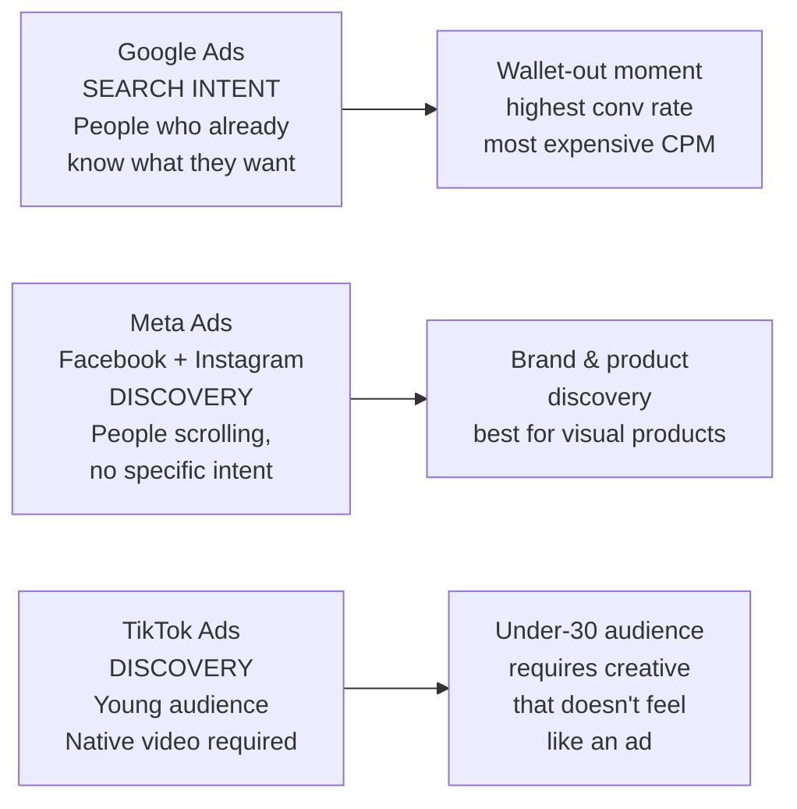
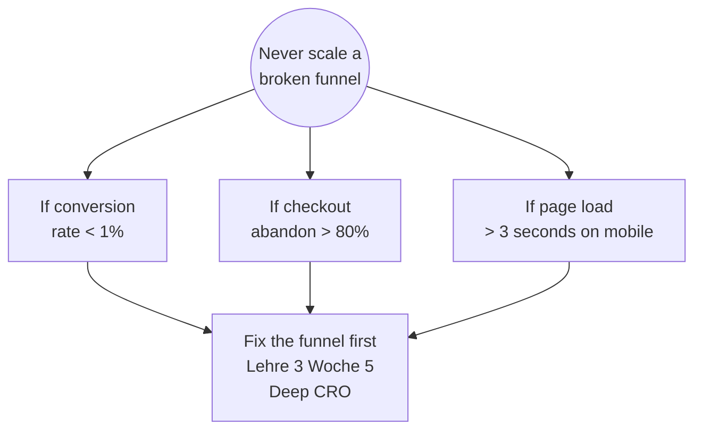
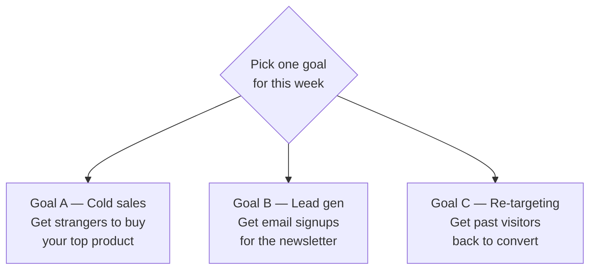
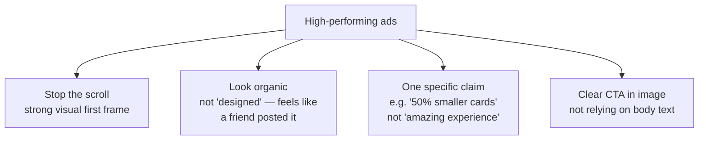
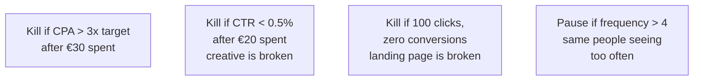

# Woche 3 — Paid ads

The fastest channel. The most dangerous channel. The one where you'll learn the most per euro spent.

Budget for this week: **€100–€300 of real ad spend**. Treat it as tuition. The data you get back is worth a course at WIFI.

Plan: **5–6 hours** plus the ad-spend week. Three sessions.

---

## The three platforms in one picture



You'll spend a little on each. Different goals, different KPIs, different mistakes to learn from.

---

## Three vocab terms before we start

You'll see these everywhere. Memorize them now:

| Term | Meaning |
|---|---|
| **CPM** (cost per mille) | Cost to show ad to 1,000 people |
| **CPC** (cost per click) | Cost when someone clicks your ad |
| **CTR** (click-through rate) | What % of people who saw the ad clicked it |
| **CPA** (cost per acquisition) | What it cost to get one customer |
| **ROAS** (return on ad spend) | Revenue earned ÷ ad spend. Good D2C: 3.0+ |
| **CAC** (customer acquisition cost) | Same as CPA, just used in SaaS land |
| **LTV** (lifetime value) | Total revenue from one customer over time |
| **CTA** (call to action) | The button/link people click |

If LTV ÷ CAC ≥ 3, the business model works. If less, you're losing money on every customer.

---

## The fundamental rule



Running ads to a broken funnel = lighting money on fire. Always.

If you did your Woche 1 funnel diagnosis honestly and the answer was *"the issue is checkout abandonment,"* skip this week, jump to Woche 5 (Deep CRO), and come back here later.

For everything else, let's run ads.

---

## Übung 1 — Pick your campaign goal (15 min)

**Deliverable:** one clear goal written down.

For each of the three platforms, you'll run **one** small test campaign. Pick one of these goals — same goal across all three platforms (you can't compare results otherwise):



For a brand-new brand without much existing traffic: **B** (lead gen) is the cheapest, most learning-rich.

For a brand with existing traffic but low return rate: **C** (re-targeting).

For a brand with a strong product page and existing email list: **A** (cold sales).

Write your goal as `lehre-3/woche-3/campaign-goal.md`. Include:
- The goal (A, B, or C)
- The specific KPI you'll measure (e.g. "cost per email signup")
- The total budget across all three platforms
- The success threshold (e.g. "if CPA < €5, scale up")

✅ Stop when the goal is written.

---

## Übung 2 — Set up your tracking (45 min)

**Deliverable:** the conversion you care about is being tracked by all three ad platforms.

Without proper tracking, you're flying blind. Every ad platform needs to know when someone converts on your site so it can optimise.

**Step 1 — Add the three pixels.**

In Lovable:

> Add these three tracking pixels to the `<head>` of every page on the site:
>
> 1. Meta Pixel — pixel ID `[paste yours from business.facebook.com → Events Manager]`
> 2. TikTok Pixel — pixel ID `[paste from ads.tiktok.com → Assets → Events]`
> 3. Google Ads tag — conversion ID `[paste from ads.google.com → Tools → Conversions]`

**Step 2 — Set up conversion events.**

For Goal B (lead gen), the conversion event is "Lead" — fires when someone submits the email form.

In Lovable:

> When someone submits the email form on the homepage:
> - Fire Meta Pixel `track('Lead')`
> - Fire TikTok `ttq.track('CompleteRegistration')`
> - Fire Google `gtag('event', 'conversion', { send_to: 'AW-...' })`

**Step 3 — Verify each one fires.**

For each pixel, install the **Meta Pixel Helper / TikTok Pixel Helper / Google Tag Assistant** Chrome extensions. Visit your site, trigger the event, watch the extensions confirm "Event fired."

✅ Stop when all three pixels confirm the conversion event firing.

---

## Übung 3 — Run a Google search campaign (90 min)

**Deliverable:** a real Google search ad running with a 7-day, €50 budget.

**Why Google search first:** highest-intent traffic. The person typing *"vegetarian restaurant Wien 1010"* is 90% ready to book.

**Setup steps:**

1. Go to **ads.google.com** → Create campaign → Search → Sales/Leads.
2. Pick your conversion event.
3. Budget: **€7/day** for 7 days = **€49 total**. Bid strategy: "Maximize conversions" (let Google's AI optimise).
4. Keywords: use the 3 from Woche 2 + 5 obvious variants. Set match type to **Phrase match** (not Broad, which wastes money on irrelevant clicks).
5. Write three ads:

```
Headline 1: Vegetarian Restaurant in Vienna 🌿
Headline 2: Quiet Sunday Brunch, 1010
Headline 3: Reservations Book Out Fast
Description 1: Locally sourced, slow food. Just 24 seats. Reserve online — Sunday tables booked 2 weeks ahead.
Description 2: A small vegetarian dining room near Stephansplatz. Open Wed–Sun. Reserve by phone or online.
```

Set up **3 different ads** to let Google test which works best.

6. Launch. Wait 24 hours. Check the impressions, clicks, CTR.

After 7 days, log the result in `lehre-3/woche-3/google-ads-result.md`:

```markdown
- Spend: €49
- Impressions: ___
- Clicks: ___
- CTR: ___%
- Conversions: ___
- CPC: €___
- CPA: €___
- Verdict: kill / refine / scale
```

✅ Stop when the campaign is live with verified spend ≥ €5.

---

## Übung 4 — Run a Meta (Instagram) ad campaign (90 min)

**Deliverable:** a Meta ad campaign running with €50 budget.

**Why Meta:** best ROI on visual products. Cheaper CPM than Google. Discovery, not intent.

**Setup steps:**

1. **business.facebook.com → Ads Manager → Create.**
2. Objective: **Leads** (for Goal B) or **Sales** (for Goal A).
3. Campaign budget: **€7/day for 7 days = €49**.
4. **Audience targeting:** start with **broad targeting** (no detailed interests). Counter-intuitive, but works because Meta's algorithm is smarter than your targeting. Limit only by country (Austria) + age range (relevant to your persona).
5. **Placements:** automatic.
6. **Creative:** make 3 different ads. Each needs:
   - **A square image (1080×1080)** — generated via AI or photographed
   - **A vertical image (1080×1350)** — for feed
   - **3 different headline / body text variations**

Creative tips:



7. Launch. Monitor daily.

After 7 days, log the result in `lehre-3/woche-3/meta-ads-result.md`. Same structure as Google.

✅ Stop when at least one Meta ad has spent €5.

---

## Übung 5 — Run a TikTok ad (90 min)

**Deliverable:** one TikTok ad live, €30 budget.

**Why TikTok:** youngest audience, lowest CPM, but **requires native creative.** A photo with text overlay flops; a 15-second TikTok-native video wins.

**Setup steps:**

1. **ads.tiktok.com** → Create campaign → Sales or Lead Gen.
2. Budget: **€10/day for 3 days = €30**.
3. **Audience:** broad, age 18–35, Austria/Germany/Switzerland.
4. **Creative:** the hardest part. Three options:
   - **Film one yourself** — a 15-sec phone video showing your product naturally, no studio
   - **Use Spark Ads** — boost one of your existing organic TikToks (if you have any)
   - **Use AI video tools** — Runway, Pika, or Lovable's video generation (lower quality but cheap)
5. Hook the first 1.5 seconds: open with movement, text that contradicts expectation, or a face. **80% of people scroll past in 1.5 seconds.**
6. Launch.

After 3 days, log in `lehre-3/woche-3/tiktok-ads-result.md`.

✅ Stop when TikTok ad has spent at least €5.

---

## Übung 6 — Compare the three (60 min)

**Deliverable:** a one-page comparison report with one clear recommendation.

After the campaigns run for at least 3 days, compare side-by-side:

| Metric | Google | Meta | TikTok |
|---|---|---|---|
| Spend | €__ | €__ | €__ |
| Impressions | __ | __ | __ |
| Clicks | __ | __ | __ |
| CTR | __% | __% | __% |
| Conversions | __ | __ | __ |
| CPA | €__ | €__ | €__ |
| ROAS | __ | __ | __ |

Then write a one-paragraph recommendation:

> "For this brand, [platform X] performed best with a CPA of €__ and ROAS of __. The most likely reason is [reason — usually about audience/intent match]. I'd recommend doubling the budget on [X] and pausing [Y]. [Z] needs better creative before scaling."

Save as `lehre-3/woche-3/comparison.md`. **This is exactly what a real growth consultant delivers.**

✅ Stop when the comparison and recommendation exist.

---

## Übung 7 — Set a kill rule (15 min)

**Deliverable:** written rules for when to pause each campaign.

Most beginners run losing ads for weeks. Pros kill in 72 hours.

The rules:



Document your kill rules in `lehre-3/woche-3/kill-rules.md`. Refer to them every morning when reviewing the campaigns.

✅ Stop when the rules are written.

---

## Meisterstück for Woche 3

- [ ] Campaign goal documented (Übung 1)
- [ ] All three pixels installed and tested (Übung 2)
- [ ] Google search campaign live with real spend (Übung 3)
- [ ] Meta campaign live with real spend (Übung 4)
- [ ] TikTok campaign live with real spend (Übung 5)
- [ ] Comparison report with a clear recommendation (Übung 6)
- [ ] Kill rules documented (Übung 7)

**Loom (4 min):** walk through your three campaigns, the comparison table, the recommendation, and what you'd do differently with €1,000 budget instead of €100. Save to `portfolio/lehre-3/woche-3-meisterstueck.mp4`.

That Loom is a literal deliverable. A real D2C brand would pay €500–€1,500 for a 90-minute strategy call that produced this output. You did it as homework.

---

## Lehrling Notiz

Most beginners' first paid campaigns are bad. So were every senior growth marketer's. The data this week is more valuable than the conversions. You're learning what burns money and what scales. Keep the documents — in 6 months you'll laugh at how much you've improved.

One last warning: **don't fall in love with one channel.** People who only do Meta lose their business the day Meta's algorithm changes. The pros run all three plus organic, weighted by what's working *this quarter.*
