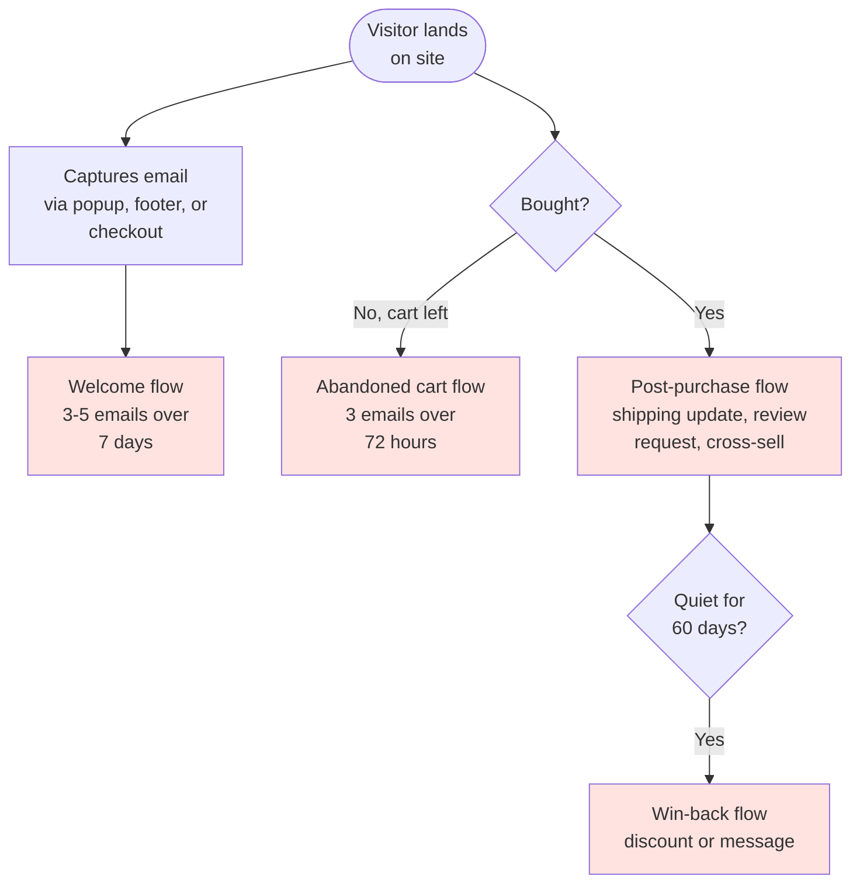
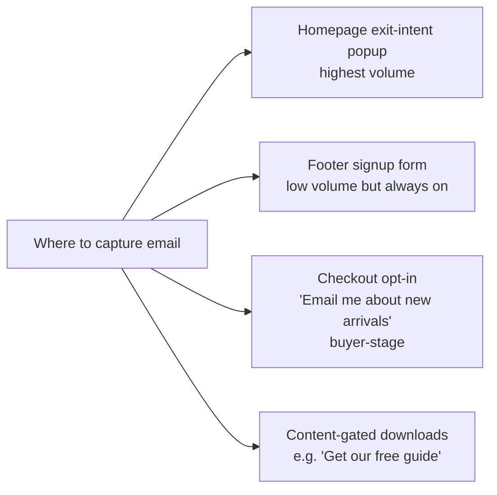
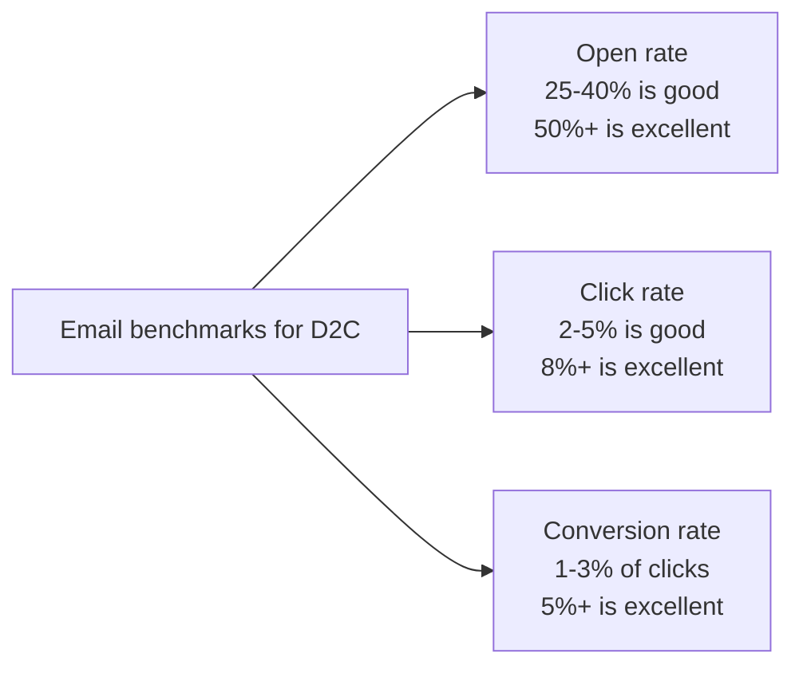

# Woche 4 — Email automation

The most under-rated channel in modern marketing. Owned (no algorithm), profitable (€36 back for every €1 spent), and quietly responsible for **20-40% of revenue** at most D2C brands.

This week you build the three flows every brand needs, then layer a fourth.

Plan: **4–5 hours** across 2 sessions.

---

## Where email fits in the funnel

These four flows are the **80/20** of D2C email. Build all four well and you've matched 90% of brands in the industry.

---

## The tool: Klaviyo

**klaviyo.com** is the D2C standard. Free up to 250 contacts. Native integration with Shopify (Lehre 2). For Lehre 1 SaaS you can also use Resend for transactional + Klaviyo for marketing, or stay 100% on Klaviyo.

Why not Mailchimp? More expensive, weaker e-commerce integration. Klaviyo wins for D2C, period.

---

## Übung 1 — Set up Klaviyo (30 min)

**Deliverable:** Klaviyo account connected to your brand, with the first email list created.

1. Sign up at **klaviyo.com**. Free.
2. **Connect to your store**:
   - For Shopify: install the Klaviyo app from Shopify App Store, one click.
   - For Lovable/SaaS: use the Klaviyo API. In Lovable: *"Add Klaviyo client API. When a user signs up or makes a purchase, push their event to Klaviyo via [their public API key]. Send email + first_name + any product they viewed/purchased."*
3. Klaviyo will automatically pull in past customers and purchase data.
4. Verify a sender domain (Klaviyo walks you through DNS records).
5. Create your first list called **"Master subscriber list."**

✅ Stop when Klaviyo is connected and you can see at least one real contact.

---

## Übung 2 — Add the email capture (45 min)

**Deliverable:** a homepage popup that gets a 5%+ signup rate.

You can't email people who don't give you their address. Capture is step zero.

For week 4, set up the popup (highest impact).

In Klaviyo: **Sign-up Forms → Create form.** Pick:

- **Exit-intent trigger** on desktop, **30-second delay** on mobile
- A clear offer: *"Get 10% off your first order — sign up below"* or *"Be the first to know when new pieces launch"*
- A clean design matching your brand (Klaviyo's editor is decent)
- Mobile-friendly (test on phone)
- Single email field, no other fields

Embed the form. Visit your site. Trigger it. Subscribe with a real email.

Watch the contact appear in Klaviyo within 30 seconds. **You now have an email capture system live.**

✅ Stop when one real email is captured via the popup.

---

## Übung 3 — Build the Welcome flow (90 min)

**Deliverable:** a 3-email welcome flow sending automatically to new subscribers.

The Welcome flow is your most-opened email sequence ever. People who just gave you their email *want* to hear from you.

**Structure:**

| # | Sent | Subject | Goal | Key element |
|---|---|---|---|---|
| 1 | Immediately | "Welcome 🌱" | Deliver the promised discount/info | Discount code or download link |
| 2 | +2 days | "The story behind [brand]" | Tell your story | Founder's photo + short text |
| 3 | +5 days | "Our most-loved pieces" | Drive first purchase | 3 product highlights + reviews |

In Klaviyo: **Flows → Create flow → Welcome Series.**

Klaviyo provides templates. Customise. **Critical:** write the emails in your brand's voice, not Klaviyo's generic template voice. Two specific moves:

1. **Open with a personal sentence**, not a banner image. *"Hey Katherina — really glad you're here."*
2. **One CTA per email.** Not three. Force the focus.

Set the trigger: *"When someone is added to Master subscriber list."*

Save the flow. **Send a test to yourself.** Check the formatting on desktop and on mobile.

✅ Stop when you've received all three test emails in your real inbox and they look good.

---

## Übung 4 — Build the Abandoned cart flow (60 min)

**Deliverable:** a 3-email abandoned cart flow sending when someone leaves a cart without buying.

This single flow recovers **3-10% of "lost" sales** at most D2C brands. It's free money.

| # | Sent after abandonment | Subject | Goal |
|---|---|---|---|
| 1 | +1 hour | "Did you forget something?" | Reminder, no discount yet |
| 2 | +24 hours | "Your cart is still here" | Soft urgency + reviews of cart items |
| 3 | +72 hours | "10% off if you complete checkout today" | Final nudge with discount |

In Klaviyo: **Flows → Create → Abandoned Cart** (built-in template).

The flow has the cart items dynamically inserted. Verify the merge tags work by sending a test from a real cart abandonment.

**Three rules for abandoned cart emails:**

1. **First email: NO discount.** Some people genuinely got distracted; the reminder is enough. Save discounts for the second touch.
2. **Include images of the cart items**, with product names and prices.
3. **One-click "Back to your cart" CTA** that restores the exact cart state.

✅ Stop when you've tested the flow by abandoning a real cart and receiving the first email.

---

## Übung 5 — Build the Post-purchase flow (45 min)

**Deliverable:** a 4-email post-purchase flow.

After someone buys, you have **the most engaged customer they'll ever be.** Most brands waste this moment with a generic "thanks for your order" and nothing else.

| # | Sent | Subject | Goal |
|---|---|---|---|
| 1 | Immediately | "Order confirmed — what happens next" | Reassurance + shipping timeline |
| 2 | At shipping | "Your order is on the way 📦" | Shipping notification + tracking |
| 3 | +7 days after delivery | "How are you finding it?" | Soft review request |
| 4 | +14 days after delivery | "Pieces that go beautifully with [their order]" | Cross-sell |

Klaviyo's e-commerce integration handles the timing automatically.

Email 3 is the **review-request gold.** A good review on the product page raises conversion rate ~5%. Asking 100 customers gets you ~15 reviews. Don't skip this email.

✅ Stop when the post-purchase flow is built and the first email tested.

---

## Übung 6 — Build the Win-back flow (30 min)

**Deliverable:** a 2-email win-back flow targeting inactive past customers.

A customer who bought once and hasn't returned in 60+ days isn't necessarily lost — they might just need a reason.

| # | Sent | Subject | Goal |
|---|---|---|---|
| 1 | When 60d inactive | "We miss you" | Soft, human tone, no discount yet |
| 2 | +5 days if no open/click | "Here's 15% off if you want to come back" | Final discount, then stop |

Trigger: a Klaviyo segment of "purchased >60 days ago AND hasn't purchased since."

After Email 2, if still inactive: **mark as suppressed** for re-engagement. Stop emailing them for 6 months. Burnt-out subscribers hurt your sender reputation.

✅ Stop when the flow is built.

---

## Übung 7 — Send your first campaign (45 min)

**Deliverable:** one one-off campaign email sent to your real list.

Flows are automated. **Campaigns** are one-off broadcasts (the newsletter style).

Pick something genuinely worth saying:

- A new product launch
- A behind-the-scenes look at how you make things
- A specific tip your customers would value (e.g. "How to layer our two scarves")
- A founder note about a current event/season

Write it:

- **Subject line under 50 chars.** Most opens happen on mobile.
- **Preheader text** that adds to the subject line. (Klaviyo lets you set this.)
- **One CTA**, repeated 2-3 times in the email.
- **Plain text feel** beats designer-template feel. Letters from a person, not flyers from a company.

Send to a small **test segment** (5–10 of your most engaged subscribers) first. If open rates ≥ 30%, send to your full list.

Log the result: open rate, click rate, conversion rate. Compare to industry benchmarks.

✅ Stop when one real campaign is sent and the metrics are logged.

---

## Übung 8 — Set up segmentation (30 min)

**Deliverable:** at least 3 segments defined for future targeting.

Sending the same email to everyone is amateur. Pros segment.

Set up these three foundational segments:

1. **Engaged active** — opened/clicked in last 30 days. Your warm list.
2. **VIP customers** — purchased 3+ times or spent €500+. Treat differently.
3. **Lapsed** — haven't opened in 90+ days. Reduce send frequency to avoid hurting deliverability.

In Klaviyo: **Lists & Segments → Create Segment.** Define each condition. Save.

When you send your next campaign, exclude the "Lapsed" segment to protect your sender score.

✅ Stop when 3 segments are saved.

---

## Meisterstück for Woche 4

- [ ] Klaviyo connected (Übung 1)
- [ ] Email capture popup live with first real signup (Übung 2)
- [ ] 3-email welcome flow active (Übung 3)
- [ ] 3-email abandoned cart flow active (Übung 4)
- [ ] 4-email post-purchase flow active (Übung 5)
- [ ] 2-email win-back flow active (Übung 6)
- [ ] One real campaign sent with results logged (Übung 7)
- [ ] 3 segments saved (Übung 8)

**Loom (4 min):** walk through your Klaviyo flow dashboard. Open each flow and explain the strategy in 30 seconds. Show your campaign metrics. Save to `portfolio/lehre-3/woche-4-meisterstueck.mp4`.

A brand owner watching this Loom understands you can **set up and run their entire email marketing system.** That's a €1,500-€3,000 project for most freelancers.

---

## Lehrling Notiz

Email feels less sexy than paid ads. It's also more profitable. The math is wild: a brand with €100k/year in revenue can usually grow email's share from 10% to 30% in 90 days with the four flows above. That's €20k of revenue you unlocked. As a freelance email-flow specialist, you'd bill €2k–€4k for that project.

Most importantly: emails are owned. When Meta changes the algorithm tomorrow, your email list still works.
