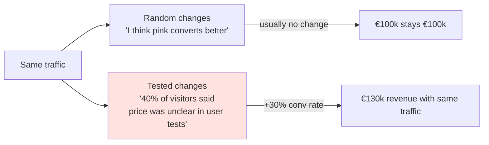
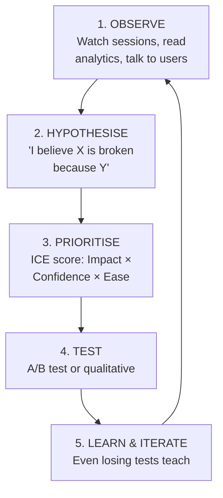
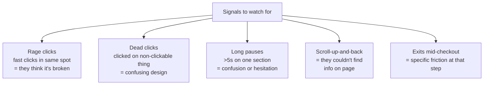
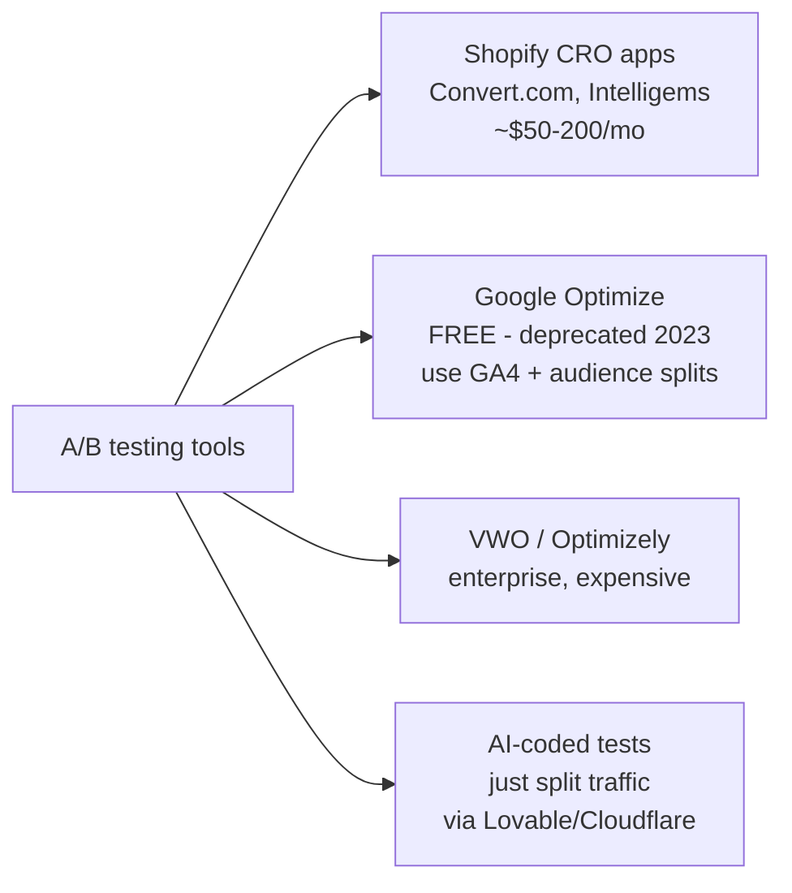
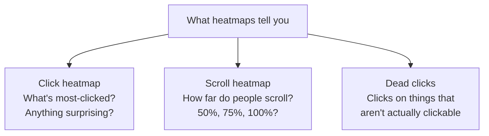
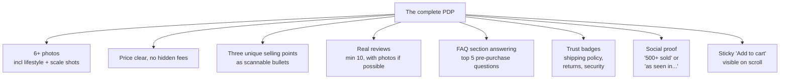

# Woche 5 — Deep CRO

Conversion rate optimisation. The skill where marketers earn the most per hour. Doubling conversion rate is worth more than doubling traffic — and you can do it without a bigger budget.

You touched CRO surface-level in Lehre 2 (Webflow/Christa style). This week is the deep cut: A/B testing, heatmaps, real funnel surgery.

Plan: **5–6 hours** across 2 sessions.

---

## The CRO mindset

The difference between gut-feel CRO and data-driven CRO. One is faith. The other is engineering.

---

## The five-step CRO loop

Every CRO improvement follows this loop. Memorise it.

Real CRO teams run this loop continuously. You'll practise one full cycle this week.

---

## Übung 1 — Watch 20 sessions and write a hypothesis (90 min)

**Deliverable:** five written hypotheses about what's breaking in your funnel.

Open Microsoft Clarity (from Woche 1). Filter for:
- Sessions over 60 seconds (skip bouncers)
- Sessions where someone reached the cart
- Sessions where someone reached checkout

Watch 20 of them. Real humans, real time. Take notes.

For each session, look for:

After 20 sessions, write 5 specific hypotheses. Each one in this format:

> **Hypothesis:** Removing the "Create account" requirement at checkout will increase checkout completion rate from ~40% to ~55%.
>
> **Why I believe it:** In 6 of 20 sessions, users hit checkout, saw "Create an account or sign in," paused for 8+ seconds, then closed the tab.
>
> **How to test it:** Show "Checkout as guest" as the primary button, "Create account" as secondary.

Save as `lehre-3/woche-5/hypotheses.md`. **The quality of your hypotheses is the quality of your CRO program.** Vague hypotheses = wasted tests.

✅ Stop when you have 5 specific hypotheses.

---

## Übung 2 — ICE score them (20 min)

**Deliverable:** the 5 hypotheses ranked by ICE score.

ICE = **Impact × Confidence × Ease.** Each scored 1–10. Multiply. Higher = test first.

| Hypothesis | Impact (1-10) | Confidence (1-10) | Ease (1-10) | Score (×) |
|---|---|---|---|---|
| Guest checkout | 9 | 8 | 7 | **504** |
| Shipping cost early | 7 | 7 | 8 | 392 |
| Bigger product photos | 5 | 4 | 9 | 180 |
| Trust badges in checkout | 4 | 5 | 9 | 180 |
| Hero rewrite | 6 | 5 | 4 | 120 |

The highest score = your first test. Save as `lehre-3/woche-5/ice-scoring.md`.

✅ Stop when 5 hypotheses are scored.

---

## Übung 3 — Set up your A/B testing tool (30 min)

**Deliverable:** an A/B test running on your live site.

Options:

For a small brand on a budget, the cheapest reliable option is **Vercel A/B testing** (free) or **simple code in Lovable** to randomly route 50/50 to two versions of a page.

In Lovable:

> Set up A/B testing on the homepage. Randomly assign each visitor to variant A or B (use localStorage to keep them in the same variant on return visits). Log the variant assignment to analytics as a custom event. Variant A = current homepage. Variant B = [variant from your hypothesis].

For Shopify: pick **Convert.com** ($59/mo) or **Intelligems** ($25/mo). Set up the same split.

✅ Stop when the test is running and you can verify two variants are being served.

---

## Übung 4 — Run the test, wait, decide (passive — 7 days)

**Deliverable:** test results with a clear winner (or "no clear winner — learn anyway").

Most tests need at least **1,000 visitors per variant** to reach statistical significance. Tools like **abtestguide.com/calc** tell you.

While it runs:

- Check daily but **don't end early**. Early-stopping is the #1 mistake in CRO.
- Don't peek and panic if variant B is "losing" at day 2. The early data is noise.
- Run for at least 7 full days (covers weekday/weekend differences).

After 7 days, calculate:

| Variant | Visitors | Conversions | Rate | Significance |
|---|---|---|---|---|
| A | 950 | 25 | 2.6% | — |
| B | 1,020 | 36 | 3.5% | 95% sig |

Write the result in `lehre-3/woche-5/test-1-results.md`:

- Winner: A or B (or "no clear winner")
- Lift: +35% (from 2.6% to 3.5%)
- What we learned (regardless of result)
- Next test based on this learning

**Don't be sad about losing tests.** ~60% of well-designed CRO tests fail. The learning is what matters.

✅ Stop when results and learnings are documented.

---

## Übung 5 — Heatmap analysis (45 min)

**Deliverable:** annotated heatmap screenshots from 3 key pages.

In Microsoft Clarity → **Heatmaps**. Pick 3 critical pages:

- Homepage
- Product page (your top-selling product)
- Cart page

For each, look at the **click heatmap** and the **scroll heatmap.**

Specific signals to flag:

- **Most-clicked thing on homepage isn't the primary CTA.** Reorder.
- **People scroll past your hero CTA quickly.** Hero copy is weak.
- **Dead clicks on product image.** Make the image clickable to expand.
- **Nobody scrolls past 50%** on the product page. Move important info higher.

Screenshot each heatmap, annotate with arrows + notes in Figma or Excalidraw. Save in `lehre-3/woche-5/heatmaps/`.

✅ Stop when 3 pages have annotated heatmap screenshots.

---

## Übung 6 — The 5-friend usability test (60 min)

**Deliverable:** notes from 5 real people walking through your site for the first time.

The quickest qualitative win in CRO. Cheaper and faster than any tool.

Find 5 people who fit your target persona. Ideally not technical, ideally not familiar with your brand. Family + friends + classmates work fine.

Ask them, in person or on a 15-min video call:

> Pretend you've never seen this site. I'll show you the homepage. I want you to **talk out loud** as you click around. What do you notice? What do you wonder about? What would you do next?

Record (with permission). Don't help. Don't explain. **Just listen and watch.**

Patterns will emerge quickly:

- 3 of 5 say "I can't find the price" → fix the price visibility
- 4 of 5 click on a non-clickable element → make it clickable
- 5 of 5 ignore your "About" link → it's not where they expect

Write up the patterns in `lehre-3/woche-5/usability-notes.md`. The usability tests have produced more conversion lifts at most brands than any A/B test.

✅ Stop when 5 sessions are documented.

---

## Übung 7 — The single highest-leverage page (90 min)

**Deliverable:** a fully rewritten product detail page (PDP), based on everything you learned this week.

Most D2C brands' #1 highest-leverage page is the product detail page. People who land here are deciding *yes or no.* A 10% lift on this page = a 10% lift on overall revenue.

Audit your top product's PDP. Compare to the gold standard:

Rewrite **everything** on the page: photos, headlines, body copy, reviews, FAQ, badges. Don't skip any of the 8 elements above.

Push live. Track conversion rate from product page → cart for the next 14 days.

✅ Stop when the rewritten PDP is live.

---

## Meisterstück for Woche 5

- [ ] 5 hypotheses written (Übung 1)
- [ ] ICE scoring done (Übung 2)
- [ ] A/B test running (Übung 3)
- [ ] Test results documented (Übung 4)
- [ ] 3 annotated heatmap screenshots (Übung 5)
- [ ] 5 usability tests documented (Übung 6)
- [ ] Top PDP fully rewritten (Übung 7)

**Loom (5 min):** show your hypothesis list, the ICE scores, your live A/B test, your annotated heatmaps, and your rewritten PDP before/after. Save to `portfolio/lehre-3/woche-5-meisterstueck.mp4`.

You can charge **€2,000–€5,000 for a CRO audit + 1 month implementation that delivers exactly what this Loom shows.** Most agencies bill 5x that for the same outcome.

---

## Lehrling Notiz

Deep CRO is the most compounding skill in marketing. Every brand you ever audit, every project you ever take on — these seven exercises become your standard opening. You'll learn to pattern-match: *"I've seen this exact funnel hole at 6 different brands. The fix is usually X."*

That pattern-matching is what senior consultants charge €300/hour for. You're building it weekly, on real sites, with real data. Don't be impatient. It's compounding.
