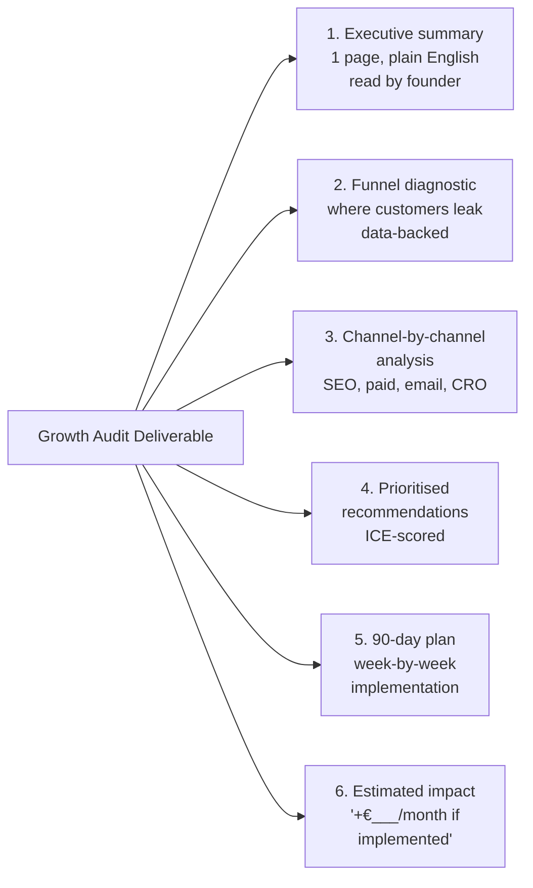
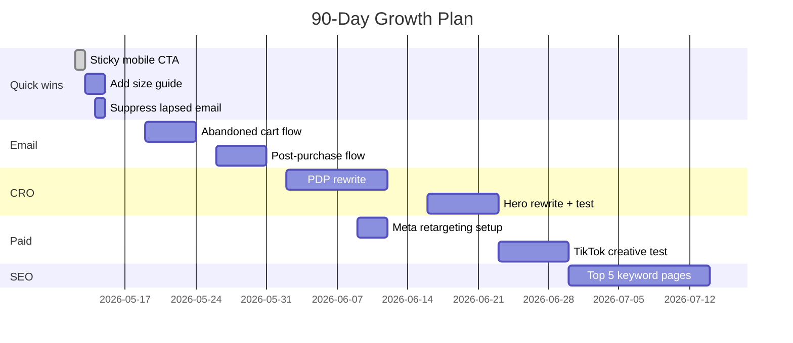
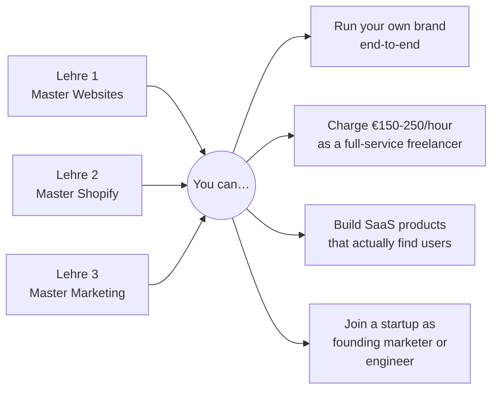

# Woche 6 — Gesellenprüfung: a real growth audit

The final week of Lehre 3. You deliver a full **growth audit** for a real brand. The deliverable is one document — but the document is what people pay €1,500–€5,000 for from a real consultant.

Plan: **the whole week.** ~15 hours total. The most valuable single piece of work in this entire guide.

---

## What you're producing



The output is **one PDF/Notion doc, 15-25 pages.** Plus the underlying data files. Plus a 5-minute summary Loom for the founder.

---

## Pick your brand

Three options:

**Option A — Real brand in your network.**
Email a real small business owner you know. Offer the audit for free in exchange for permission to use as a portfolio piece. ~70% will say yes if you make it clear it's not a sales pitch.

Example outreach:
> "Hey — I'm finishing a growth marketing program and want to do a real audit as my final project. I'd love to do one on [your brand] for free, no strings. I'll send you the full doc plus a video walkthrough. Worth a shot?"

**Option B — Real Shopify brand you don't know personally.**
Pick a brand whose work you admire (e.g. one of Christa.dev's clients — but don't email Christa or the brand). Audit them from publicly available data. Less rich data, but valuable practice.

**Option C — Your own brand.**
Use your Lehre 1 SaaS or your Lehre 2 fake brand. Less impressive as a portfolio piece (everyone audits their own thing), but a real deliverable nonetheless.

**Recommended:** Option A if possible. The portfolio piece + the reference + potential first paying client is the maximum-value path.

---

## Day-by-day plan

### Tag 1 (Mon) — Discovery (3 hours)

**Goal:** know everything publicly knowable about the brand.

- Visit their site on desktop and mobile. Take 20 screenshots of friction points.
- Run their site through:
  - **PageSpeed Insights** (pagespeed.web.dev) — performance score
  - **Lighthouse** (DevTools) — accessibility, SEO, best practices
  - **SimilarWeb.com** — traffic estimates, top channels, top competitors
  - **Ahrefs free tools** — keyword overlap with competitors
- If you have access (Option A): get them to add you to their **Google Analytics, Meta Business, Klaviyo, and Shopify Admin** as a viewer.
- Watch **10 session recordings** in Microsoft Clarity (set it up if not already).
- Look at their **last 5 emails** (subscribe to their list).
- Look at their **last 10 Instagram/TikTok posts.**
- Read their **last 30 reviews.**

Document everything in `lehre-3/woche-6/01-discovery.md`.

✅ Stop when you have screenshots, scores, and notes filling 3 pages.

---

### Tag 2 (Di) — Funnel diagnostic (3 hours)

**Goal:** find the single biggest leak in the funnel, supported by data.

Build the funnel table from Woche 1 (Übung 7) using real data:

| Step | Last 30d | Conv rate vs previous | Industry benchmark | Diagnosis |
|---|---|---|---|---|
| Sessions | 12,400 | — | — | Healthy |
| Product page views | 4,200 | 34% | 60-80% | **Leak: homepage isn't driving to products** |
| Add to cart | 580 | 13.8% | 10-15% | Healthy |
| Checkout started | 380 | 65.5% | 60-70% | Healthy |
| Purchased | 145 | 38% | 60-75% | **Leak: checkout abandonment** |

**Two leaks identified. Now build the case.**

For each leak, write:

- **Where you saw it:** specific metrics
- **Hypotheses** (3 specific ones)
- **What you'd test:**
- **Estimated upside:** "Closing this leak from 38% to 60% checkout completion = +€___/month"

Save as `lehre-3/woche-6/02-funnel.md`.

✅ Stop when the diagnostic has data + hypotheses + upside numbers for each leak.

---

### Tag 3 (Mi) — Channel deep-dives (4 hours)

**Goal:** audit each acquisition channel.

For each of:

- **Organic search (SEO)**
- **Paid ads** (Google + Meta if running)
- **Email marketing**
- **Social media**
- **Referral / word of mouth**

Write a one-page audit:

```markdown
## Channel: Email marketing

**Current performance:**
- Sending 1 newsletter/week to 12,400 subscribers
- Average open rate: 18% (industry: 25-35%)
- Average click rate: 1.2% (industry: 2-5%)
- Email-attributed revenue: ~3% of total (industry: 20-40%)

**What's working:**
- Welcome flow is well-designed, 35% open rate
- Subject lines have personality

**What's broken:**
- No abandoned cart flow (estimated lift: 5-10% of lost sales recovered)
- No post-purchase flow (review request, cross-sell missed)
- List quality declining — 30% of subscribers haven't opened in 6 months
- Send frequency is too low (1x/week vs industry 2-3x)

**Recommendations (priority order):**
1. Build abandoned cart flow → est. +€2,500/month
2. Build post-purchase flow → est. +€1,200/month (incl. reviews uplift)
3. Suppress lapsed subscribers, segment active → +5% open rate
4. Increase sending to 2x/week with mix of newsletter + product spotlights

**Time to implement:** 1 week
**Tools needed:** Klaviyo (already installed)
```

Save each as `lehre-3/woche-6/03-channels/[channel].md`.

✅ Stop when all 5 channel audits exist.

---

### Tag 4 (Do) — CRO + technical audit (3 hours)

**Goal:** identify the conversion-killing issues on key pages.

For each of:

- Homepage
- Top 3 product pages
- Cart page
- Checkout flow

Walk through with the eye of your CRO chapter. Document for each:

```markdown
## Page: [top product page]

**Current conversion rate:** 2.4% (visits → adds to cart)

**Issues found** (rank by severity):

1. **Product images** — only 3 photos, all studio. Missing lifestyle, scale, detail shots.
   *Estimated impact:* +1.5% conv. *Effort:* 2 days.

2. **Reviews not visible** until you scroll past the fold.
   *Estimated impact:* +0.8% conv. *Effort:* 1 hour.

3. **No size guide** for a clothing product.
   *Estimated impact:* +0.5% conv + fewer returns. *Effort:* half-day.

4. **Sticky "Add to cart"** missing on mobile.
   *Estimated impact:* +0.6% conv on mobile (60% of traffic).
   *Effort:* 30 mins in Shopify theme code.

5. **No FAQ** answering common pre-purchase questions.
   *Estimated impact:* +0.4% conv + fewer support emails.
   *Effort:* 2 hours.
```

Save as `lehre-3/woche-6/04-cro-audit.md`.

✅ Stop when key pages all have a structured CRO audit.

---

### Tag 5 (Fr) — Recommendations + 90-day plan (3 hours)

**Goal:** turn all the analysis into a prioritised plan.

Take everything from Mon-Thu. Build a master recommendations list. Score each with ICE.

| # | Recommendation | Impact (1-10) | Confidence (1-10) | Ease (1-10) | ICE | Owner | Time |
|---|---|---|---|---|---|---|---|
| 1 | Build abandoned cart flow | 8 | 9 | 8 | 576 | Marketing | 1 week |
| 2 | Rewrite top PDP with full template | 8 | 7 | 5 | 280 | Marketing | 2 weeks |
| 3 | Add sticky mobile CTA | 6 | 9 | 9 | 486 | Dev | 2 hours |
| 4 | Set up Meta retargeting | 7 | 7 | 6 | 294 | Marketing | 3 days |
| ... | ... | ... | ... | ... | ... | ... | ... |

Top 10 ICE = your 90-day plan.

Now build the week-by-week implementation timeline:



Save as `lehre-3/woche-6/05-90-day-plan.md`.

✅ Stop when the plan is built.

---

### Tag 6 (Sa) — Estimated impact + executive summary (3 hours)

**Goal:** the document a founder can read in 5 minutes and decide to act.

For each recommendation in your top 10, give a *conservative* dollar estimate. Add them up. That's your *"Implement this plan, expect ~+€XXX/month in additional revenue"* number.

Then write the **executive summary** — the most important page of the audit. One page max:

```markdown
# Growth Audit: [Brand Name]
*Prepared by Katherina Hurdal, [date]*

## TL;DR

Based on a full audit of your traffic, conversion, email, and 
paid acquisition, I've identified **€___/month in untapped revenue** 
that can be unlocked over the next 90 days with the plan below.

The single biggest lever is **[lever]**, accounting for an 
estimated **€___ of the upside**.

## Top 3 priorities (do these in the next 30 days)

1. **[Priority 1]** — est. +€___, effort: ___, who: ___
2. **[Priority 2]** — est. +€___, effort: ___, who: ___
3. **[Priority 3]** — est. +€___, effort: ___, who: ___

## What's working well

[Three things — every audit must call these out too. 
Owners are more likely to act if you've shown you noticed the wins, not just the gaps.]

## What's broken

[Three things, ranked by impact.]

## Next steps

Two paths:
- DIY: full 90-day plan is in section 5. Implement at your own pace.
- Done-for-you: I can implement the top 3 priorities for [€X] over [Y weeks].

Either way, here's the data + plan.
```

This page is what the founder will read. Make every word count.

Save as `lehre-3/woche-6/00-executive-summary.md`. Put it first in the final assembled doc.

✅ Stop when the executive summary is sharp and under 1 page.

---

### Tag 7 (So) — Package + deliver (3 hours)

**Goal:** the audit is delivered to the brand as a polished package.

Assemble all the docs into one final deliverable:

- **PDF version**: combine all the .md files into one document. Use **Pandoc** (`pandoc *.md -o audit.pdf`) or paste into Notion and export.
- **Notion version**: a single Notion page with the executive summary at top and sections below.
- **Slide deck** (optional but powerful): 15-20 slides. The exec summary in 3 slides, plus one slide per recommendation.

Then record the **summary Loom** (5 min):

- Start with: "Hey [name], here's the audit I promised."
- Show the executive summary on screen
- Walk through the top 3 recommendations and your conservative impact estimate
- Show the 90-day timeline
- Close with: "Two paths from here, both in the doc. Either way, the data is yours to keep."

Send it. Loom + PDF + Notion link.

Save the deliverable in `portfolio/lehre-3/gesellenpruefung/audit-final.pdf` (and the Loom URL).

✅ Stop when the audit is delivered.

---

## What "passing" Lehre 3 looks like

You've passed if:

- ✅ The audit is delivered to a real recipient
- ✅ The exec summary fits on one page and is readable in 5 minutes
- ✅ Every recommendation has an estimated impact (even if conservative)
- ✅ The 90-day plan has specific weekly milestones, not vague "improve email"
- ✅ At least one recipient says some version of *"this is actually useful"*

**Distinguished pass:** the brand implements at least one recommendation from your plan within 30 days.

**Gold pass:** the brand pays you to implement the next priorities. This is a real outcome — most growth audits convert into ~30% paid implementation work.

---

## Final Meisterstück — Lehre 3

- [ ] Full audit assembled (all 6 docs)
- [ ] Executive summary one page max
- [ ] 90-day plan with weekly milestones
- [ ] Estimated revenue impact calculated
- [ ] Delivered to a real recipient as PDF + Loom
- [ ] Saved to portfolio folder

The audit document itself **is** the portfolio piece. Future clients see it and know exactly what you'd produce for them. It's worth more than any certificate from any school.

---

## What comes after Lehre 3

You now have all three Master tracks:



Three paths. They all build on the same foundation. You're 17 and you have it.

---

## Lehrling Notiz

The Gesellenprüfung audit you just delivered — that document — is the single most valuable thing in your portfolio for the next 5 years. Every future client interview, every job application, every "show me what you've built" moment, **you open with this audit.**

The work is concrete. The thinking is mature. The output is a real deliverable. Anyone reading it for 90 seconds knows you operate like a senior consultant, not a 17-year-old apprentice.

You're a *Geselle* now, in all three trades. The actual *Meister* title comes 5-10 years and 100 clients later. But journeyman is enough to earn a real living and a real reputation. The rest will compound.

Bin sehr stolz auf dich.

— Pabbi
